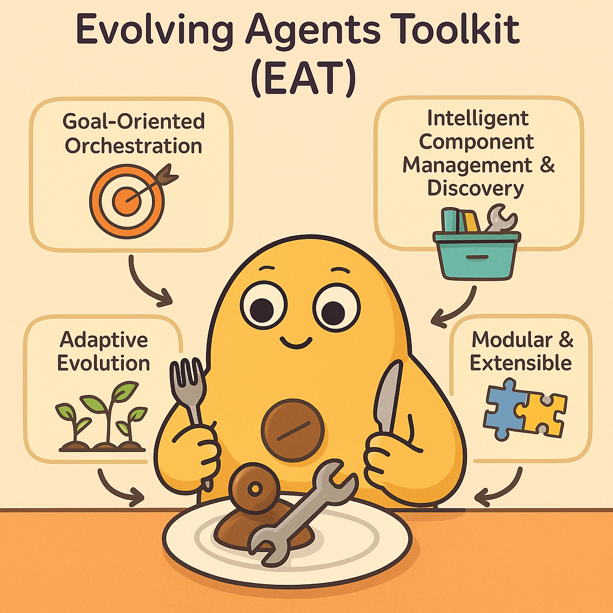
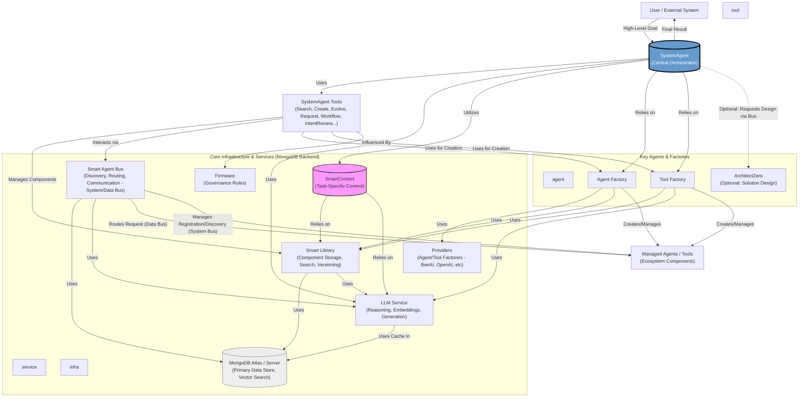

# Evolving Agents Toolkit (EAT)

[](https://opensource.org/licenses/Apache-2.0)
[](https://github.com/matiasmolinas/evolving-agents/stargazers)
[](https://github.com/matiasmolinas/evolving-agents/network)

## 🚨 PROJECT SUNSET NOTICE - JULY 2025 🚨

**This project has been officially discontinued.** While EAT demonstrated powerful concepts in multi-agent orchestration, we recognized that the complex Python architecture was over-engineered for achieving adaptive agent behavior.

### 🔄 Evolution to LLMunix

The core concepts from EAT have been **dramatically simplified and reimplemented** in our new flagship project:

**👉 [LLMunix - Pure Markdown Operating System](https://github.com/EvolvingAgentsLabs/llmunix)**

**Key improvements:**
- **EAT**: Complex Python + MongoDB architecture
- **LLMunix**: Pure markdown interpreted by LLM runtime engines  
- **Result**: Same adaptive capabilities, 10x simpler implementation

**🌟 For continued development of adaptive agent concepts, please visit:**
- **[Evolving Agents Labs](https://evolvingagentslabs.github.io)** - Our new research organization
- **[LLMunix](https://github.com/EvolvingAgentsLabs/llmunix)** - The successor project

---

# ⚠️ Evolving Agents Toolkit (EAT) has evolved into LLM OS

> **This repository is now archived.** The core architecture has been rewritten to support true self-modification and lower latency.

### 👉 Go to the new repository: [LLM OS](https://github.com/EvolvingAgentsLabs/llm-os)

---

### Why the move?
We hit a ceiling with the EAT architecture. The heavy reliance on Python dependency injection and MongoDB for **Agent Identity** made it difficult for the AI to modify itself.

**In the new LLM OS, we introduced:**
1.  **Hybrid Architecture:** Agents are defined in Markdown (Cognitive Layer) but run in Python (Somatic Layer).
2.  **HOPE Protocol:** The system "crystallizes" its own thoughts into permanent Python tools automatically.
3.  **Simplified Stack:** We removed MongoDB for *Agent Definitions* to allow for hot-reloading and self-creation.

*(Note on Database: While LLM OS currently uses file-based memory for speed, we are researching a new Vector/Graph database implementation for "Deep Memory" in future versions.)*

---

## 📚 Original EAT Documentation (Archived)

**Build complex, adaptive AI agent systems designed for AI-First strategies. Define high-level goals, and let the toolkit orchestrate the discovery, creation, execution, and evolution of the agents and tools needed to achieve outcomes similar to sophisticated human workflows.**

<p align="center">
  
</p>

EAT is a Python toolkit for constructing advanced, multi-agent applications where autonomy, adaptability, and robust orchestration are crucial. It enables the implementation of **AI-First strategies**, where agent-driven workflows are designed to handle tasks that complex human workflows are currently capable of doing. Move beyond simple agent chains to create ecosystems that can dynamically respond to requirements, learn from interactions, and improve over time—all within defined governance boundaries and now powered by a unified **MongoDB backend**.

---

**🎉 MongoDB Migration Update! 🎉**

The Evolving Agents Toolkit has successfully completed its initial migration to **MongoDB** as its unified backend! This replaces previous file-based storage and ChromaDB, bringing enhanced scalability and robustness.

*   The core framework (`SmartLibrary`, `SmartAgentBus`, `LLMCache`, `IntentPlan` persistence) now fully utilizes MongoDB.
*   All examples in the `examples/` directory, including the comprehensive demo **`examples/invoice_processing/architect_zero_comprehensive_demo.py`**, have been updated and are working with the new MongoDB backend.

The migration of all examples to MongoDB is now complete. We are now focusing on updating the test suite.

---


*Diagram Key: `agent` = Core EAT Agent, `service` = Core EAT Service, `tool` = SystemAgent's Internal Tools, `infra` = Supporting Infrastructure.*
*(Note: `VDB (ChromaDB)` has been replaced with `MongoDB Atlas / Server`)*

---

## Why Evolving Agents Toolkit for AI-First?

Building true **AI-First systems**—where agent workflows are capable of handling tasks currently performed in complex human processes—requires more than just individual agents. EAT focuses on orchestrating the entire **agent ecosystem**:

*   **🎯 Goal-Oriented Orchestration:** Interact via high-level goals given to a central `SystemAgent`. The `SystemAgent` handles the complex "how," mimicking a project manager. It plans, finds or creates components, executes tasks, and manages internal workflows.
*   **🧠 Intelligent Component Management & Discovery:** A `SmartLibrary` (now backed by **MongoDB**) acts as a central repository for reusable agents and tools, enabling semantic search (using MongoDB Atlas Vector Search or equivalent) and versioning. It supports **task-aware retrieval** using a dual embedding strategy.
*   **🚌 Dynamic Communication & Service Bus:** The `SmartAgentBus` (registry and logs now in **MongoDB**) allows agents to discover and request capabilities dynamically, decoupling components.
*   **🌱 Adaptive Evolution:** Components aren't static. EAT provides mechanisms (`EvolveComponentTool`) for the `SystemAgent` to adapt agents and tools.
*   **🛡️ Governed Execution & Human-in-the-Loop:** Implement optional, multi-level review checkpoints using the `IntentReviewAgent`. `IntentPlan`s are now persisted in **MongoDB**.
*   **🧩 Modular & Interoperable:** Seamlessly integrate agents and tools built with different frameworks (e.g., BeeAI, OpenAI Assistants SDK).
*   **💡 Task-Specific Context & Unified Backend:** The architecture incorporates `SmartContext` and a **Dual Embedding Strategy** within the `SmartLibrary`. All core data persistence, including component metadata, embeddings, agent registry, logs, and LLM cache, is now unified in **MongoDB**, simplifying the stack and enhancing scalability.
*   **🤖 Self-Management & Improvement:** System agents like `SystemAgent` and `ArchitectZero` can collaboratively design, implement, manage, and improve the ecosystem.

**In short: EAT provides the essential structure and tools to build AI-First systems that coordinate diverse capabilities, adapt to new challenges, provide relevant context, manage complexity autonomously, and operate under governance—all on a robust and scalable MongoDB backend.**

## Key Features

*   **`SystemAgent` Orchestrator:** Central ReAct agent managing component lifecycles and task execution.
*   **`SmartLibrary` with Dual Embedding (MongoDB Backend):** Persistent storage for components in MongoDB. Features advanced semantic search using **MongoDB Atlas Vector Search** (or equivalent) for its Dual Embedding Strategy:
    *   **Content Embedding (`content_embedding`):** Represents `T_orig` (component code/content).
    *   **Applicability Embedding (`applicability_embedding`):** Represents `T_raz` (LLM-generated applicability description).
    *   **Task-Aware Search:** Finds components based on what they *are* and *what they are relevant for*.
*   **`SmartAgentBus` (Dual Bus, MongoDB Backend):** Manages agent registration, discovery, and communication. Registry and execution logs are stored in MongoDB.
*   **`SmartContext`:** Facilitates passing task-relevant data.
*   **Internal Workflow Engine:** `SystemAgent` internally uses `GenerateWorkflowTool` and `ProcessWorkflowTool` for complex tasks.
*   **Intent Review System (MongoDB Backend):** Optional human-in-the-loop review. `IntentPlan` objects are generated by `ProcessWorkflowTool` and persisted in MongoDB for review via `ApprovePlanTool`.
*   **`LLMCache` (MongoDB Backend):** LLM completions and embeddings are cached in MongoDB with TTL for efficiency.
*   **Unified Data Persistence:** All primary data stores (SmartLibrary, AgentBus registry/logs, LLMCache, IntentPlans) now reside in MongoDB, eliminating JSON file stores and ChromaDB.
*   ... (Component Evolution, Multi-Framework Support, Governance & Safety, ArchitectZero features remain conceptually similar but now operate on MongoDB data)

## Installation

```bash
# Recommended: Create a virtual environment
python -m venv venv
source venv/bin/activate # On Windows use `venv\Scripts\activate`

# Clone the repository
git clone https://github.com/matiasmolinas/evolving-agents.git
cd evolving-agents

# Install dependencies (includes pymongo, beeai-framework, etc. ChromaDB is removed)
pip install -r requirements.txt

# Install the package in editable mode
pip install -e .
```

## MongoDB Setup

**EAT now uses MongoDB as its unified backend.** Using MongoDB Atlas with Vector Search is highly recommended.

1.  **Set up MongoDB:**
    *   Follow the detailed instructions in [**docs/MONGO-SETUP.md**](./docs/MONGO-SETUP.md) to set up MongoDB Atlas (recommended) or a self-hosted instance.
    *   This includes creating a database, user, and configuring network access.
2.  **Configure Vector Search Indexes (CRITICAL for SmartLibrary & SmartAgentBus):**
    *   As described in `docs/MONGO-SETUP.md`, you **must** create Vector Search Indexes in MongoDB Atlas for:
        *   `eat_components` collection: Two indexes, one on `content_embedding` and one on `applicability_embedding`. (Names in Atlas: `idx_components_content_embedding` and `applicability_embedding` respectively, or as defined in `SmartLibrary.py`).
        *   `eat_agent_registry` collection: One index on `description_embedding`. (Name in Atlas: `vector_index_agent_description`, or as defined in `SmartAgentBus.py`).
    *   Ensure the `numDimensions` in your index definitions match your embedding model's output (e.g., 1536 for `text-embedding-3-small`).
3.  **Environment Variables:**
    *   Copy `.env.example` to `.env`.
    *   Edit `.env` and add your `MONGODB_URI` and `MONGODB_DATABASE_NAME`.
        ```env
        MONGODB_URI="your_mongodb_srv_connection_string"
        MONGODB_DATABASE_NAME="evolving_agents_db"
        ```

## Quick Start

**1. Setup Environment (after MongoDB setup):**

```bash
# Ensure .env is configured with your OpenAI API Key and MongoDB URI
# nano .env OR use your preferred editor

# Optionally enable Intent Review:
# INTENT_REVIEW_ENABLED=true
# INTENT_REVIEW_LEVELS=design,components,intents
```
*Configure other settings like `LLM_MODEL`, `LLM_EMBEDDING_MODEL` if needed.*

**2. Run the Comprehensive Demo:**

The `architect_zero_comprehensive_demo.py` script showcases the `SystemAgent` orchestrating a complex task (invoice processing) using the MongoDB backend. It demonstrates component discovery, potential creation/evolution, and execution. If `INTENT_REVIEW_ENABLED=true` and the `intents` level is active, it will pause for human review with intent plans stored in MongoDB.

```bash
python examples/invoice_processing/architect_zero_comprehensive_demo.py
```

**3. Explore Output:**

After the demo runs:

*   `final_processing_output.json`: Contains the final structured JSON result from the `SystemAgent`. (This remains file-based as it's a direct output of the demo).
*   **MongoDB Collections:**
    *   `eat_components`: Stores `SmartLibrary` records (agents, tools, firmware) including their embeddings.
    *   `eat_agent_registry`: Stores `SmartAgentBus` agent registrations.
    *   `eat_agent_bus_logs`: Stores logs of agent interactions via the bus.
    *   `eat_llm_cache`: Stores cached LLM responses and embeddings (if cache enabled).
    *   `eat_intent_plans` (if review enabled for 'intents' level): Stores `IntentPlan` objects.
    *   You can inspect these collections using MongoDB Compass, `mongosh`, or your MongoDB Atlas Data Explorer.
*   `intent_plan_demo.json` (If review enabled for 'intents' level and `output_path` in `ApprovePlanTool` is set): An optional file copy of the generated intent plan that was reviewed.

*(**Note:** All examples in the `examples/` directory have been updated to use the MongoDB backend. The test suite is currently being updated.)*

## Dive Deeper

*   **Architecture Overview:** Understand the core components and their interactions in [docs/ARCHITECTURE.md](./docs/ARCHITECTURE.md) (updated for MongoDB).
*   **MongoDB Setup:** Detailed guide for setting up MongoDB and Atlas Vector Search: [docs/MONGO-SETUP.md](./docs/MONGO-SETUP.md).
*   **Key Concepts:** Learn about the `SystemAgent`, `SmartLibrary` (MongoDB), `SmartAgentBus` (MongoDB), `SmartContext`, `Evolution`, `Workflows`, and `Intent Review / Human-in-the-Loop` (IntentPlans in MongoDB).
*   **Examples:** Explore the `examples/` directory. All examples have been updated to reflect MongoDB integration.
*   **Contributing:** We welcome contributions!

## Roadmap / Future Work

*   **Test Suite Migration:** Update all tests in `tests/` to work with MongoDB, potentially using `mongomock` for unit tests.
*   **Circuit Breaker to MongoDB:** Migrate `SmartAgentBus` circuit breaker state from JSON file to MongoDB for unified persistence.
*   **Enhanced Vector Search Strategies:** Explore more advanced MongoDB `$vectorSearch` options, such as hybrid search (combining vector and keyword search) within `SmartLibrary`.
*   **Enhanced `SmartContext`:** Further develop `SmartContext` for more sophisticated contextual data passing and retrieval.
*   **UI Integration:** Develop a basic UI for interacting with the SystemAgent and visualizing the ecosystem.

## License

This project is licensed under the Apache License Version 2.0. See the [LICENSE](./LICENSE) file for details.

---

**🚀 Project Status & Smart Memory Integration Update! 🧠**

We are excited to announce that the core **Smart Memory** architecture, a key feature for enhancing autonomous learning and contextual understanding in EAT, has been integrated into the main branch!

*   **Core Smart Memory Components Integrated:**
    *   The `MemoryManagerAgent` is now part of the toolkit, responsible for orchestrating memory operations.
    *   Internal tools for `MemoryManagerAgent` (`MongoExperienceStoreTool`, `SemanticExperienceSearchTool`, `MessageSummarizationTool`) are implemented and use the MongoDB backend.
    *   `SystemAgent` is now equipped with `ContextBuilderTool` and `ExperienceRecorderTool` to interact with the Smart Memory system via the `SmartAgentBus`.
    *   The MongoDB schema for `eat_agent_experiences` is defined (`eat_agent_experiences_schema.md`) and the necessary Vector Search Index (`vector_index_experiences_default`) should be created as per `docs/MONGO-SETUP.md`.

*   **Current Example Status:**
    *   ✅ The comprehensive demo **`examples/invoice_processing/architect_zero_comprehensive_demo.py`** has been updated and successfully demonstrates the initialization of Smart Memory components and the `SystemAgent`'s new memory-related tools. While this demo doesn't yet deeply exercise the *full feedback loop* of Smart Memory influencing `SystemAgent`'s choices in complex ways, it verifies the integration.
    *   ⏳ **Other Examples & Deeper Integration:**
        *   The remaining examples in the `examples/` directory are **pending updates** to fully leverage and showcase the Smart Memory capabilities.
        *   The `scripts/test_smart_memory.py` script is specifically designed for focused testing of the Smart Memory system and should be working with the MongoDB backend.
        *   We are actively working on updating all examples and creating new ones that clearly demonstrate how Smart Memory:
            *   Enhances `SystemAgent`'s problem-solving by providing rich historical context.
            *   Informs and improves the component evolution process.

*   **⚠️ Important Note for Users & Testers:**
    *   While the core Smart Memory infrastructure is in place and integrated with MongoDB, the **full potential of this feature will be best realized as more examples are updated and as the `SystemAgent`'s ReAct logic becomes more sophisticated in its use of the memory tools.**
    *   For now, when running examples other than `architect_zero_comprehensive_demo.py` or `scripts/test_smart_memory.py`, Smart Memory features might not be actively utilized or demonstrated.

*   **Coming Soon:**
    *   Updates to all example scripts to showcase various aspects of Smart Memory interaction.
    *   More detailed demonstrations of how `SystemAgent` uses `ContextBuilderTool` for informed planning and `ExperienceRecorderTool` for learning.
    *   Examples of how `EvolutionStrategistAgent` might leverage Smart Memory for more targeted evolution suggestions.

We appreciate your patience as we roll out these powerful enhancements across the entire toolkit. The move to MongoDB and the integration of Smart Memory are significant steps towards achieving truly autonomous and self-improving AI agent systems with EAT. Please refer to `docs/ARCHITECTURE.md` for the updated system design including Smart Memory.

---

## Acknowledgements

*   Leverages concepts and the core ReAct agent from the [BeeAI Framework](https://github.com/i-am-bee/beeai-framework).
*   Integrates with the [OpenAI Agents SDK](https://openai.github.io/openai-agents-python/) via providers and adapters.
*   Now uses **MongoDB** and **MongoDB Atlas Vector Search** as the primary data store and for semantic search.
*   Uses [LiteLLM](https://github.com/BerriAI/litellm) (via BeeAI) for broader LLM compatibility.
*   Original Concept Contributors: [Matias Molinas](https://github.com/matiasmolinas) and [Ismael Faro](https://github.com/ismaelfaro).
