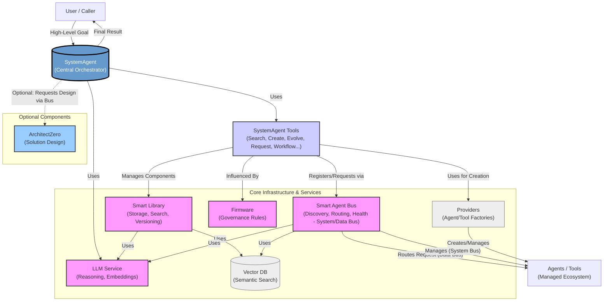

# Evolving Agents Toolkit (EAT)

[](https://opensource.org/licenses/Apache-2.0)
[](https://github.com/matiasmolinas/evolving-agents/stargazers)
[](https://github.com/matiasmolinas/evolving-agents/network)

**Build complex, adaptive AI agent systems that manage themselves. Define high-level goals, and let the toolkit orchestrate the discovery, creation, execution, and even evolution of the agents and tools needed to achieve them.**

<p align="center">
  
</p>

EAT is a Python toolkit designed for building sophisticated, multi-agent applications where autonomy, adaptability, and robust orchestration are key. Move beyond simple agent chains and create ecosystems that can dynamically respond to requirements and improve over time, all within defined governance boundaries.

---



---

## Why Evolving Agents Toolkit?

Many frameworks help build individual agents. EAT focuses on the **ecosystem**:

*   **🎯 Goal-Oriented Orchestration:** Interact via high-level goals given to a central `SystemAgent`. It handles the complex "how" – planning, finding/creating components, executing tasks, and managing internal workflows. You don't micromanage; you state the objective.
*   **🧠 Intelligent Component Management & Discovery:** A `SmartLibrary` stores agents and tools, enabling semantic search (find tools based on *what they do*) and versioning. The `SmartAgentBus` (with its distinct System and Data buses) allows agents to discover and use capabilities across the system dynamically.
*   **🌱 Adaptive Evolution:** Agents and tools aren't static. EAT provides mechanisms for the `SystemAgent` to evolve components based on new requirements, feedback, or performance analysis using defined strategies.
*   **🧩 Modular & Extensible:** Seamlessly integrate agents built with different frameworks (e.g., BeeAI, OpenAI Agents SDK) via a flexible provider system. Define clear operational rules and safety guardrails using `Firmware`.
*   **🤖 Self-Management Potential:** The core architecture allows the system agents themselves (like `SystemAgent` and `ArchitectZero`) to collaboratively design, implement, manage, and potentially improve the ecosystem, including the toolkit's own components (see `examples/self_improvement/evolve_smart_library.py`).

**In short: If you need to build agent systems that are more than the sum of their parts – systems that can coordinate, adapt, and manage complexity autonomously – EAT provides the structure and capabilities.**

## Key Features

*   **`SystemAgent` Orchestrator:** A central ReAct agent (using BeeAI) that acts as the primary entry point, using specialized tools to manage the entire lifecycle based on high-level goals.
*   **`SmartLibrary`:** Persistent storage with semantic search (vector embeddings via ChromaDB), versioning, and evolution capabilities for agents & tools.
*   **`SmartAgentBus` (Dual Bus):** Manages agent registration, discovery, health (System Bus), and capability-based requests/communication (Data Bus).
*   **Internal Workflow Engine:** The `SystemAgent` can generate and execute multi-step YAML workflows internally for complex goals, abstracting this complexity.
*   **Component Evolution:** Adapt agents/tools using different strategies (standard, conservative, aggressive, domain adaptation) orchestrated by the `SystemAgent`.
*   **Multi-Framework Support:** Pluggable provider architecture (`BeeAIProvider`, `OpenAIAgentsProvider`) managed by `AgentFactory` and `ToolFactory`.
*   **Governance:** Define operational rules and safety guardrails via `Firmware` and adapters (`OpenAIGuardrailsAdapter`).
*   **(Optional) `ArchitectZero`:** A specialized agent (typically called *internally* by `SystemAgent`) to design complex multi-component solutions from requirements.

## Installation

```bash
# Recommended: Create a virtual environment
python -m venv venv
source venv/bin/activate # On Windows use `venv\Scripts\activate`

# Clone the repository
git clone https://github.com/matiasmolinas/evolving-agents.git
cd evolving-agents

# Install dependencies
pip install -r requirements.txt

# Install the package in editable mode (allows easy development)
pip install -e .
```

## Quick Start

**1. Setup Environment:**

```bash
# Copy the example environment file
cp .env.example .env

# Edit the .env file and add your API keys (e.g., OPENAI_API_KEY)
# nano .env  OR use your preferred editor
```
*Configure other settings like `LLM_MODEL` if needed.*

**2. Run the Comprehensive Demo:**

This is the best way to see the full orchestration in action. The `SystemAgent` is given a high-level goal to process an invoice. Internally, it orchestrates component discovery, potential creation/evolution (using its tools), and execution.

```bash
python examples/invoice_processing/architect_zero_comprehensive_demo.py
```

**3. Explore Output:**

After the demo runs, check the generated files in the main directory:

*   `final_processing_output.json`: Contains the final structured JSON result from the `SystemAgent`, along with its detailed thought process log.
*   `smart_library_demo.json`: The state of the component library after the run (shows created/evolved components).
*   `smart_agent_bus_demo.json`: The state of the agent registry on the bus.
*   `agent_bus_logs_demo.json`: Logs of agent interactions via the System and Data buses.

*(**Note:** The comprehensive demo is currently the primary quick start. Simpler, focused examples may be added in the future.)*

## Dive Deeper

*   **Architecture Overview:** Understand the core components and how they interact in [docs/ARCHITECTURE.md](./docs/ARCHITECTURE.md).
*   **Key Concepts:** Learn about the `SystemAgent`, `SmartLibrary`, `SmartAgentBus`, `Evolution`, and `Workflows` in detail. *(Action Required: Create `docs/CONCEPTS.md` or link to individual `TECH-REF` files)*
*   **Technical Reference:** Explore detailed descriptions of core components:
    *   [SmartLibrary](./docs/TECH-REF_SMARTLIBRARY.md) *(Action Required: Create)*
    *   [SmartAgentBus](./docs/TECH-REF_SMARTAGENTBUS.md) *(Action Required: Create)*
    *   [SystemAgent & Orchestration](./docs/TECH-REF_SYSTEMAGENT.md) *(Action Required: Create)*
    *   [Component Evolution](./docs/TECH-REF_EVOLUTION.md) *(Action Required: Create)*
    *   [Providers & Multi-Framework](./docs/TECH-REF_PROVIDERS.md) *(Action Required: Create)*
    *   [Governance & Firmware](./docs/TECH-REF_GOVERNANCE.md) *(Action Required: Create)*
*   **Examples:** Explore the `examples/` directory for various use cases:
    *   `invoice_processing/`: The flagship demo.
    *   `agent_evolution/`: Creating and evolving agents/tools with BeeAI & OpenAI.
    *   `smart_agent_bus/`: Demonstrating the Dual Bus operations.
    *   `self_improvement/`: Evolving the `SmartLibrary` itself.
    *   *And more...*
*   **Contributing:** We welcome contributions! Please see [CONTRIBUTING.md](./CONTRIBUTING.md) *(Action Required: Create)*.

## Roadmap / Future Work

*   **Smart Context & Memory:** Implement a `SmartContext` providing intelligent key-value storage and message history, managed by a `SmartMemory` component.
*   **Smart Cache:** Introduce `SmartCache` that selectively caches successful LLM calls (e.g., temp=1) for agent/tool improvement.
*   **Enhanced Evolution:** Leverage `SmartContext`, `SmartMemory`, and `SmartCache` to further automate and improve agent/tool evolution, potentially including LLM fine-tuning feedback loops.
*   **Observability:** Improve logging and tracing across components for better debugging and monitoring.
*   **More Providers:** Add support for other agent frameworks (e.g., LangChain, AutoGen).
*   **UI Integration:** Explore options for a basic UI for monitoring and managing the ecosystem.
*   **Testing:** Expand unit and integration test coverage.

## License

This project is licensed under the Apache License Version 2.0. See the [LICENSE](./LICENSE) file for details.

## Acknowledgements

*   Relies on concepts and components from [BeeAI Framework](https://github.com/i-am-bee/beeai-framework).
*   Integrates with [OpenAI Agents SDK](https://platform.openai.com/docs/assistants/overview) via providers.
*   Uses [ChromaDB](https://www.trychroma.com/) for semantic search.
*   Uses [LiteLLM](https://github.com/BerriAI/litellm) (via BeeAI) for broader LLM support.
*   Original Concept Contributors: [Matias Molinas](https://github.com/matiasmolinas) and [Ismael Faro](https://github.com/ismaelfaro).