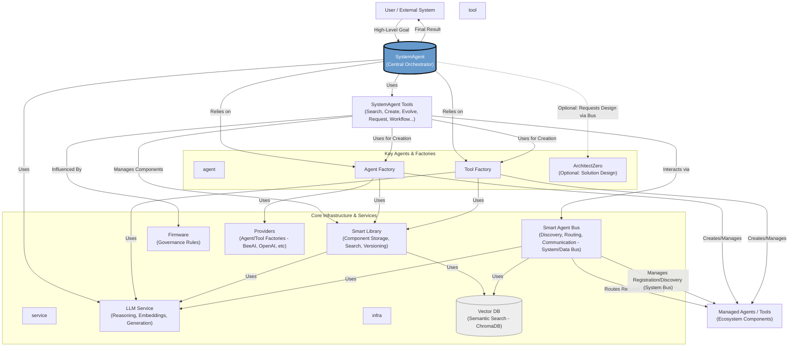

# Evolving Agents Toolkit (EAT)

[](https://opensource.org/licenses/Apache-2.0)
[](https://github.com/matiasmolinas/evolving-agents/stargazers)
[](https://github.com/matiasmolinas/evolving-agents/network)

**Build complex, adaptive AI agent systems designed for AI-First strategies. Define high-level goals, and let the toolkit orchestrate the discovery, creation, execution, and evolution of the agents and tools needed to achieve outcomes similar to sophisticated human workflows.**

<p align="center">
  
</p>

EAT is a Python toolkit for constructing advanced, multi-agent applications where autonomy, adaptability, and robust orchestration are crucial. It enables the implementation of **AI-First strategies**, where agent-driven workflows are designed to handle tasks that complex human workflows are currently capable of doing. Move beyond simple agent chains to create ecosystems that can dynamically respond to requirements, learn from interactions, and improve over time—all within defined governance boundaries.

---


*Diagram Key: `agent` = Core EAT Agent, `service` = Core EAT Service, `tool` = SystemAgent's Internal Tools, `infra` = Supporting Infrastructure.*

---

## Why Evolving Agents Toolkit for AI-First?

Building true **AI-First systems**—where agent workflows are capable of handling tasks currently performed in complex human processes—requires more than just individual agents. EAT focuses on orchestrating the entire **agent ecosystem**:

*   **🎯 Goal-Oriented Orchestration:** Interact via high-level goals given to a central `SystemAgent` (e.g., "Process this invoice," "Generate a project backlog from this meeting transcript"). The `SystemAgent` handles the complex "how," mimicking a project manager coordinating resources. It plans, finds or creates components, executes tasks, and manages internal workflows derived from the goal. You state the objective; the system orchestrates the execution.
*   **🧠 Intelligent Component Management & Discovery:** A `SmartLibrary` acts as a central repository for reusable agents and tools, enabling semantic search (find tools based on *what they do*, not just names) and versioning. This allows the system to discover and leverage existing capabilities efficiently.
*   **🚌 Dynamic Communication & Service Bus:** The `SmartAgentBus` (with distinct System and Data buses) allows agents to discover and request capabilities across the system dynamically, decoupling components and enabling flexible interactions similar to microservices.
*   **🌱 Adaptive Evolution:** Components aren't static. EAT provides mechanisms (`EvolveComponentTool`) for the `SystemAgent` to evolve agents and tools based on new requirements, performance feedback, or changing contexts, enabling the system to adapt and improve over time.
*   **🧩 Modular & Interoperable:** Seamlessly integrate agents and tools built with different frameworks (e.g., BeeAI, OpenAI Assistants SDK) via a flexible provider system (`AgentFactory`, `ToolFactory`, `providers/`). Define clear operational rules and safety guardrails using `Firmware`.
*   **🤖 Self-Management & Improvement:** The architecture allows system agents like `SystemAgent` and (optionally) `ArchitectZero` to collaboratively design, implement, manage, and even improve the ecosystem, including the toolkit's own components (see `examples/self_improvement/evolve_smart_library.py`).

**In short: If you aim to build AI-First systems that are more than the sum of their parts—systems that can coordinate diverse capabilities, adapt to new challenges, and manage complexity autonomously—EAT provides the essential structure and tools.**

## Key Features

*   **`SystemAgent` Orchestrator:** A central ReAct agent (using BeeAI) acting as the primary entry point. It uses specialized tools to manage the entire component lifecycle (search, create, evolve) and task execution based on high-level goals.
*   **`SmartLibrary`:** Persistent storage (`smart_library.json`) with semantic search (vector embeddings via ChromaDB), versioning, and evolution capabilities for agents & tools.
*   **`SmartAgentBus` (Dual Bus):** Manages agent registration, discovery, health monitoring (System Bus), and capability-based requests/communication (Data Bus), logging interactions (`agent_bus_logs_demo.json`).
*   **Internal Workflow Engine:** For complex goals, the `SystemAgent` can *internally* generate and execute multi-step YAML workflows (`GenerateWorkflowTool`, `ProcessWorkflowTool`), abstracting this complexity from the user.
*   **Component Evolution:** Adapt agents/tools using different strategies (e.g., standard, conservative, aggressive, domain adaptation) orchestrated by the `SystemAgent` via `EvolveComponentTool`.
*   **Multi-Framework Support:** Pluggable provider architecture (`providers/`, `AgentFactory`, `ToolFactory`) allows integrating components built with different SDKs (e.g., `BeeAIProvider`, `OpenAIAgentsProvider`). Adapters (`adapters/`) bridge interfaces (e.g., `OpenAIToolAdapter`).
*   **Governance & Safety:** Define operational rules and safety constraints via `Firmware` and apply them during component creation/evolution or runtime (e.g., `OpenAIGuardrailsAdapter`).
*   **(Optional) `ArchitectZero`:** A specialized agent (see `agents/architect_zero.py`) that can be called *internally* by the `SystemAgent` (via the Agent Bus) to design complex multi-component solutions based on requirements.

## Installation

```bash
# Recommended: Create a virtual environment
python -m venv venv
source venv/bin/activate # On Windows use `venv\Scripts\activate`

# Clone the repository
git clone https://github.com/matiasmolinas/evolving-agents.git
cd evolving-agents

# Install dependencies (includes beeai-framework, openai-agents, chromadb, etc.)
pip install -r requirements.txt

# Install the package in editable mode (allows easy development)
pip install -e .
```

## Quick Start

**1. Setup Environment:**

```bash
# Copy the example environment file
cp .env.example .env

# Edit the .env file and add your API keys (e.g., OPENAI_API_KEY)
# nano .env  OR use your preferred editor
```
*Configure other settings like `LLM_MODEL`, `LLM_EMBEDDING_MODEL` if needed (defaults are provided in `.env.example` and `config.py`).*

**2. Run the Comprehensive Demo:**

This demo showcases the `SystemAgent` orchestrating a complex task (invoice processing) based on a high-level goal. It demonstrates component discovery, potential creation/evolution (using its internal tools), and execution.

```bash
python examples/invoice_processing/architect_zero_comprehensive_demo.py
```

**3. Explore Output:**

After the demo runs, check the generated files in the main directory (or as specified in the demo script):

*   `final_processing_output.json`: Contains the final structured JSON result from the `SystemAgent`, potentially including its detailed thought process log.
*   `smart_library_demo.json`: The state of the component library (`SmartLibrary`) after the run, showing created/evolved components.
*   `smart_agent_bus_demo.json`: The state of the agent registry on the `SmartAgentBus`.
*   `agent_bus_logs_demo.json`: Logs of agent interactions via the System and Data buses.

*(**Note:** This comprehensive demo is currently the primary quick start. Explore the `examples/` directory for more focused use cases.)*

## Dive Deeper

*   **Architecture Overview:** Understand the core components and their interactions in [docs/ARCHITECTURE.md](./docs/ARCHITECTURE.md).
*   **Key Concepts:** Learn about the `SystemAgent`, `SmartLibrary`, `SmartAgentBus`, `Evolution`, and `Workflows` in detail. *(Action Required: Create `docs/CONCEPTS.md` or similar)*
*   **Technical Reference:** Explore detailed descriptions of core components:
    *   [SmartLibrary](./docs/TECH-REF_SMARTLIBRARY.md) *(Action Required: Create)*
    *   [SmartAgentBus](./docs/TECH-REF_SMARTAGENTBUS.md) *(Action Required: Create)*
    *   [SystemAgent & Orchestration](./docs/TECH-REF_SYSTEMAGENT.md) *(Action Required: Create)*
    *   [Component Evolution](./docs/TECH-REF_EVOLUTION.md) *(Action Required: Create)*
    *   [Providers & Multi-Framework](./docs/TECH-REF_PROVIDERS.md) *(Action Required: Create)*
    *   [Governance & Firmware](./docs/TECH-REF_GOVERNANCE.md) *(Action Required: Create)*
*   **Examples:** Explore the `examples/` directory for various use cases:
    *   `invoice_processing/`: The flagship comprehensive demo.
    *   `agent_evolution/`: Demonstrates creating and evolving agents/tools with BeeAI & OpenAI frameworks.
    *   `smart_agent_bus/`: Showcases the Dual Bus (System/Data) operations.
    *   `self_improvement/`: Example of evolving the `SmartLibrary` component itself.
    *   `autocomplete/`: Building a context-aware autocomplete system.
    *   `forms/`: Creating and running conversational forms.
*   **Contributing:** We welcome contributions! Please see [CONTRIBUTING.md](./CONTRIBUTING.md) *(Action Required: Create)*.

## Roadmap / Future Work

*   **Smart Context & Memory (Enhanced Retrieval):** Implement a `SmartContext` providing intelligent key-value storage and message history. A key planned enhancement is a **Dual Embedding Strategy** for the knowledge base, creating separate embeddings for raw content (`E_orig`) and LLM-generated task applicability/reasoning (`E_raz`). This aims to significantly improve the retrieval of task-specific context for agents, making the provided information more relevant and reducing noise. Managed potentially by a `SmartMemory` component.
*   **Smart Cache:** Introduce `SmartCache` that selectively caches successful LLM calls (e.g., high-quality generations) for agent/tool improvement feedback loops.
*   **Enhanced Evolution:** Leverage `SmartContext`, `SmartMemory`, and `SmartCache` to further automate and refine agent/tool evolution, potentially including LLM fine-tuning based on performance.
*   **Enhanced Observability:** Improve logging and distributed tracing across components for better debugging, monitoring, and performance analysis of agent workflows.
*   **More Providers:** Add support for other agent frameworks (e.g., LangChain, AutoGen).
*   **UI Integration:** Explore options for a basic UI for monitoring the agent bus, library, and task execution.
*   **Testing:** Expand unit and integration test coverage significantly (`tests/`).

## License

This project is licensed under the Apache License Version 2.0. See the [LICENSE](./LICENSE) file for details.

## Acknowledgements

*   Leverages concepts and the core ReAct agent from the [BeeAI Framework](https://github.com/i-am-bee/beeai-framework).
*   Integrates with the [OpenAI Agents SDK](https://openai.github.io/openai-agents-python/) via providers and adapters.
*   Uses [ChromaDB](https://www.trychroma.com/) for vector storage and semantic search within `SmartLibrary` and `SmartAgentBus`.
*   Uses [LiteLLM](https://github.com/BerriAI/litellm) (via BeeAI) for broader LLM compatibility.
*   Original Concept Contributors: [Matias Molinas](https://github.com/matiasmolinas) and [Ismael Faro](https://github.com/ismaelfaro).