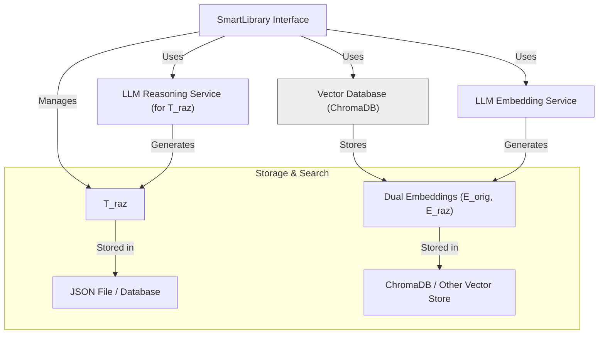
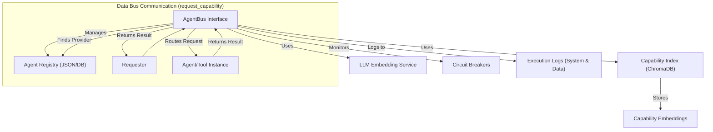
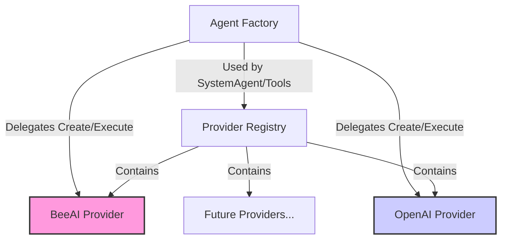
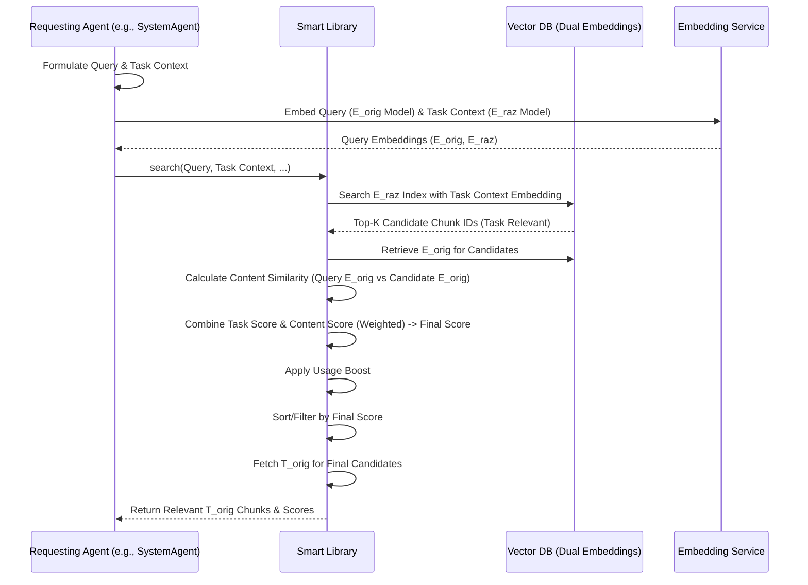
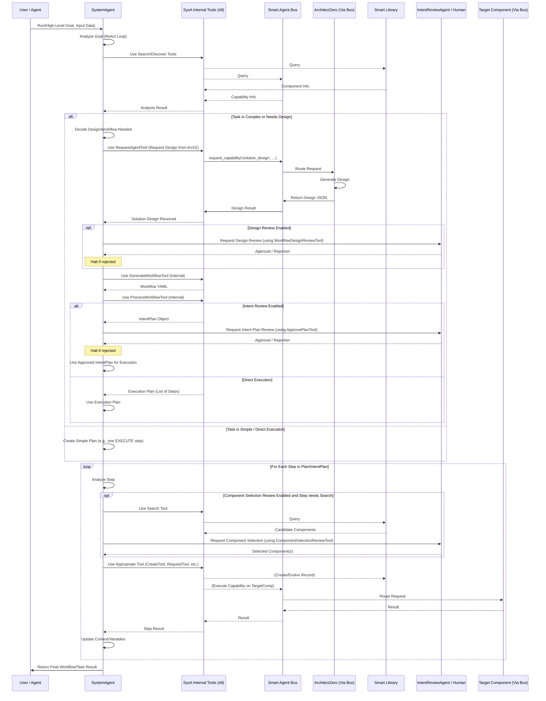
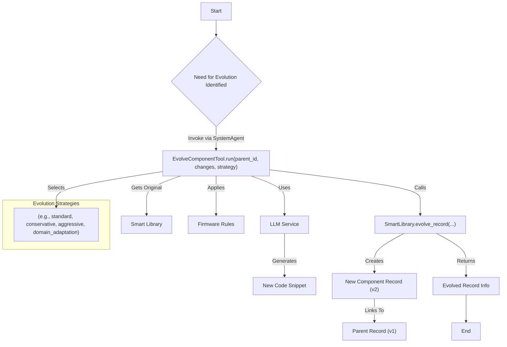
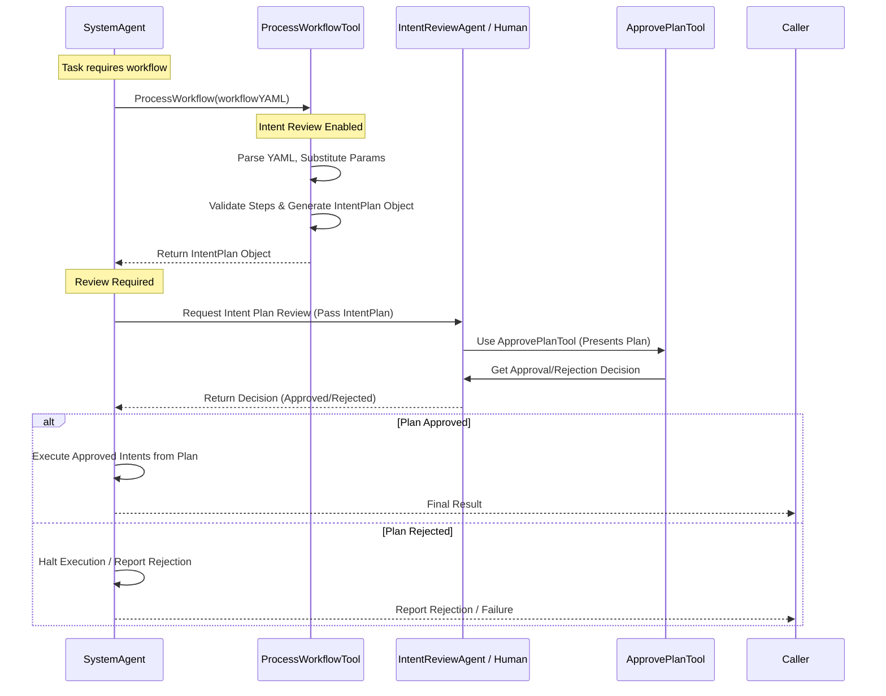

# Evolving Agents Toolkit - Architecture

This document details the architectural design of the Evolving Agents Toolkit, focusing on its core components, interactions, and design philosophy.

## 1. Introduction & Philosophy

The Evolving Agents Toolkit aims to provide a robust framework for building *ecosystems* of autonomous AI agents, rather than just individual agents. The core philosophy is **agent-centric**: the system itself is managed and orchestrated by specialized agents (like the `SystemAgent`), which leverage tools to interact with underlying services and manage other components.

Key goals of the architecture include:

*   **Autonomy & Evolution:** Enable agents and components to be created, evaluated, and improved over time, potentially automatically.
*   **Modularity & Reusability:** Promote the reuse of components (agents, tools) through discovery and adaptation via the `SmartLibrary`.
*   **Interoperability:** Support agents and tools built with different underlying frameworks (e.g., BeeAI, OpenAI Agents SDK) through a provider pattern.
*   **Decoupled Communication:** Facilitate communication based on *capabilities* rather than direct references using the `SmartAgentBus`.
*   **Governance & Safety:** Embed safety and ethical considerations through `Firmware` and guardrails, enhanced by an optional, configurable human-in-the-loop review process.
*   **Task-Relevant Context:** Provide agents with context that is not just topically similar but specifically relevant to the task they are performing (leveraging the implemented Dual Embedding Strategy in `SmartLibrary` and `SmartContext`).
*   **Orchestration:** Provide mechanisms for achieving complex goals. The `SystemAgent` handles complex, multi-step tasks by potentially designing (via `ArchitectZero`), generating, processing, and executing workflows *internally*. External callers interact via high-level goals.

## 2. Core Components

The toolkit is composed of several key interacting components:

### 2.1. SystemAgent

The central orchestrator and primary entry point of the ecosystem.

*   **Implementation:** A `beeai_framework.agents.react.ReActAgent`.
*   **Role:** Receives high-level goals or tasks and determines the best execution strategy. It manages component lifecycles (search, create, evolve via tools), facilitates communication (via Agent Bus tools), and handles complex task execution. It uses `SmartContext` to understand the task at hand and leverages the `SmartLibrary`'s task-aware search to find relevant components. For multi-step tasks, it *internally* orchestrates the use of its specialized workflow tools (`GenerateWorkflowTool`, `ProcessWorkflowTool`). When **Intent Review** is enabled, the `ProcessWorkflowTool` generates an `IntentPlan` which is then reviewed before the `SystemAgent` executes the approved steps.
*   **Key Tools:**
    *   **SmartLibrary Tools:** `SearchComponentTool`, `CreateComponentTool`, `EvolveComponentTool`, `TaskContextTool`, `ContextualSearchTool` for managing components and task-aware context.
    *   **AgentBus Tools:** `RegisterAgentTool`, `RequestAgentTool`, `DiscoverAgentTool` for managing agent registration and communication/execution.
    *   **Workflow Tools (Internal Use):**
        *   `GenerateWorkflowTool`: Translates solution designs (often obtained internally, e.g., from ArchitectZero via the AgentBus) into executable YAML workflow strings. *Not typically called directly by external users.*
        *   `ProcessWorkflowTool`: Parses workflow YAML, substitutes parameters, validates structure. If Intent Review is *disabled*, produces a step-by-step execution plan for the SystemAgent's ReAct loop. If Intent Review is *enabled*, produces an `IntentPlan` object for review. *Not typically called directly by external users.*
    *   **Intent Review Tools (Optional, used during review):** `WorkflowDesignReviewTool`, `ComponentSelectionReviewTool`, `ApprovePlanTool`. While available to the `SystemAgent`, these are primarily invoked during the human-in-the-loop review process.
    *   **(Optional) Framework-Specific Tools:** Tools for interacting directly with specific frameworks (e.g., `CreateOpenAIAgentTool`, `EvolveOpenAIAgentTool`).

### 2.2. ArchitectZero Agent

A specialized agent responsible for *designing* solutions, typically invoked by the `SystemAgent` via the `SmartAgentBus` when needed.

*   **Implementation:** Typically a `ReActAgent` (as shown in `agents/architect_zero.py`).
*   **Role:** Analyzes high-level requirements, queries the `SmartLibrary`, designs multi-component solutions, and specifies components.
*   **Output:** Produces a structured *solution design* (e.g., JSON). This design serves as a blueprint *for the SystemAgent* to understand how to orchestrate component creation and execution, potentially involving internal workflow generation and design review.
*   **Key Tools (Internal):** `AnalyzeRequirementsTool`, `DesignSolutionTool`, `ComponentSpecificationTool`.

### 2.3. Smart Library

The persistent storage and discovery mechanism for all reusable components.

*   **Stores:** Agents, Tools, Firmware definitions as structured records (typically JSON). Each record includes original content/code (`T_orig`) and potentially LLM-generated applicability text (`T_raz`).
*   **Discovery (Dual Embedding Implemented):**
    *   Stores two embeddings per record: `E_orig` (for `T_orig` content) and `E_raz` (for `T_raz` applicability text).
    *   Supports **Task-Aware Semantic Search**: Finds components based on a **Task-Context Query** by primarily searching against `E_raz` (applicability) and optionally refining results using `E_orig` (content) similarity. This provides context relevant to the *specific task* being performed. (See `tools.smart_library.search_component_tool.py` and `smart_library.py`).
    *   Also supports standard semantic search (primarily using `E_orig`).
*   **Versioning & Evolution:** Tracks component versions and parentage, facilitating evolution (`evolve_record`).
*   **Interface:** Provides methods like `create_record`, `find_record_by_id`, `semantic_search` (standard), `task_aware_search` (dual embedding implemented via semantic_search with task_context parameter), `evolve_record`.
*   **Backends:** Pluggable storage (JSON file default) and vector database (ChromaDB default).
*   **Indexing Pipeline:** Includes a step to generate `T_raz` using an LLM (`generate_applicability_text` in `LLMService`) and compute/store both `E_orig` and `E_raz` (`_sync_vector_db`).

### 2.4. Smart Agent Bus (Service Bus)

Manages inter-agent communication and capability discovery/execution. Implements a logical **Dual Bus** structure:

*   **System Bus:** Handles system-level operations like agent registration (`register_agent`), discovery (`discover_agents`), health monitoring (`_check_circuit_breaker`), and status retrieval (`get_agent_status`). These operations focus on managing the agent ecosystem. Logging for these events is marked with `bus_type='system'`. Direct execution via `execute_with_agent` is also considered a system-level/debug operation.
*   **Data Bus:** Handles agent-to-agent communication and task execution via capability requests (`request_capability`). This is the primary channel for agents (including the `SystemAgent`) to interact and delegate tasks based on function. Logging for these events is marked with `bus_type='data'`.

*   **Role:** Acts as a central "nervous system" allowing agents to request services based on capability descriptions rather than specific agent names.
*   **Discovery:** Uses semantic matching (via embeddings generated by `LLMService`) to find registered providers (agents/tools) that match a requested capability query.
*   **Routing:** Directs requests to the best-matching, healthy provider.
*   **Resilience:** Implements circuit breakers to temporarily disable failing providers.
*   **Monitoring:** Logs agent executions and interactions (distinguishing System vs. Data Bus).
*   **Interface:** `register_agent`, `discover_agents`, `request_capability`, `get_agent_status`, `health_check`.

### 2.5. Smart Context

A data structure used to pass relevant information between agents and tools within a workflow or task execution.

*   **Role:** Carries task-specific data, user input, intermediate results, and importantly, the **current task context description**.
*   **Task Relevance:** The current task context stored within `SmartContext` is used by components like `SystemAgent` and `SearchComponentTool` to perform task-aware retrieval from the `SmartLibrary`.
*   **Dual Embedding Interaction:** While `SmartContext` holds the task description, the dual embeddings themselves reside within the `SmartLibrary`. The context enables the *querying* mechanism to leverage those embeddings effectively.
*   **Intent Plan Handling:** Can carry the `IntentPlan` object during the review process.

### 2.6. Providers & Agent Factory

Abstract interaction with different underlying agent frameworks.

*   **`FrameworkProvider` (Abstract Base Class):** Defines the interface (`create_agent`, `execute_agent`, `supports_framework`) that concrete providers (e.g., `BeeAIProvider`, `OpenAIAgentsProvider`) must implement.
*   **`ProviderRegistry`:** Holds instances of available providers.
*   **`AgentFactory`:** Used internally (e.g., by `CreateComponentTool` or the `SystemAgent`) via the `ProviderRegistry` to find the correct provider for a given framework and delegate agent creation/execution to that provider. Allows the rest of the system to work with agents generically.

### 2.7. Dependency Container

Manages the instantiation and wiring of core components.

*   **Role:** Handles dependency injection to avoid circular imports and manage the initialization lifecycle. Ensures components like `SmartLibrary`, `AgentBus`, `LLMService`, `SystemAgent` receive their required dependencies during setup.

### 2.8. LLM Service

*   **Role:** Provides interface to underlying LLM models for text generation, standard embeddings (`E_orig`), applicability embeddings (`E_raz`), and reasoning capabilities needed for generating applicability text (`T_raz`). Includes caching capabilities. See `core/llm_service.py`.

### 2.9. Firmware

Provides governance rules and operational constraints.

*   **Role:** Injects safety guidelines, ethical constraints, and domain-specific rules into agents and tools during creation or evolution.
*   **Mechanism:** Typically provides prompts or configuration data used by `CreateComponentTool`, `EvolveComponentTool`, and framework providers (e.g., via `OpenAIGuardrailsAdapter`).

### 2.10. Adapters

Bridge different interfaces or formats.

*   **`OpenAIGuardrailsAdapter`:** Converts `Firmware` rules into OpenAI Agents SDK guardrail functions.
*   **`OpenAIToolAdapter`:** Converts Evolving Agents/BeeAI tools into a format compatible with the OpenAI Agents SDK `function_tool`.
*   **`OpenAITracingAdapter`:** (Optional) Integrates OpenAI Agents SDK tracing with the toolkit's monitoring.

### 2.11. Intent Review System (Optional)

Provides multi-level human-in-the-loop review and approval capabilities.

*   **`IntentReviewAgent`:** A specialized agent (e.g., `ReActAgent`) designed to analyze and review plans, component selections, or designs based on safety, relevance, and effectiveness criteria. Can be used for AI-driven review or to facilitate human review.
*   **Intent Review Tools:**
    *   `WorkflowDesignReviewTool`: Facilitates review of high-level workflow designs generated by `ArchitectZero` or `SystemAgent`.
    *   `ComponentSelectionReviewTool`: Presents candidate components (found via search) to a reviewer for selection or approval before use.
    *   `ApprovePlanTool`: Facilitates review and approval/rejection of a detailed `IntentPlan` before execution.
*   **`IntentPlan`:** A structured representation (see `core/intent_review.py`) of the sequence of actions (`Intents`) the `SystemAgent` plans to execute. Generated by `ProcessWorkflowTool` when review is enabled. Each `Intent` details the component, action, parameters, justification, and dependencies.

## 3. Key Architectural Patterns & Flows

### 3.1. Agent Communication (via Agent Bus)

Agents interact based on *what* needs to be done (capability), not *who* does it, primarily using the Data Bus (`request_capability`).

### 3.2. Task-Aware Context Retrieval (Dual Embedding Strategy - Implemented)

When an agent (e.g., `SystemAgent`) needs context for a specific task, it leverages the dual embedding capability of the `SmartLibrary` via tools like `ContextualSearchTool` or by passing `task_context` to `SearchComponentTool`.

1.  **Query Formulation:** The agent formulates a query (`query`) and provides a description of its current task (`task_context`).
2.  **Query Embedding:** The `SmartLibrary` (or `LLMService`) embeds the `query` (for content relevance) and the `task_context` (for applicability relevance).
3.  **Applicability Search:** The `SmartLibrary` searches its vector index using the `task_context` embedding against the stored Applicability Embeddings (`E_raz`). This retrieves chunks whose *inferred applicability* matches the task.
4.  **Refinement & Scoring:** The library combines the task relevance score (from `E_raz` match) and the content relevance score (similarity between `query` embedding and `E_orig`) using a weighting mechanism (e.g., `task_weight`). This produces a `final_score`. Usage metrics may also boost the score.
5.  **Content Retrieval:** The `SmartLibrary` fetches the original text content (`T_orig`) for the final ranked list of chunk identifiers based on `final_score`.
6.  **Context Provision:** The agent receives the highly relevant `T_orig` chunks tailored to its specific task.

### 3.3. Workflow Generation & Execution (Orchestrated by SystemAgent)

Complex tasks requiring multiple steps or new components are handled internally by the `SystemAgent`. The external caller simply provides the high-level goal. **Note:** Steps involving review are detailed in section 3.6.

1.  **Goal Intake:** An external caller (User or another Agent) provides a high-level goal and necessary input data to the `SystemAgent`.
2.  **Analysis & Planning (Internal):** The `SystemAgent`'s ReAct loop analyzes the goal. It uses its tools (`SearchComponentTool`, `DiscoverAgentTool`) potentially with task context to check if existing, suitable components can achieve the goal directly.
3.  **Design & Workflow Decision (Internal):**
    *   *If* the task is complex, requires multiple steps, or necessitates new/evolved components:
        *   The `SystemAgent` *may* internally request a *solution design* from `ArchitectZero` (using `RequestAgentTool` on the Agent Bus). **(Optional Design Review Point)**
        *   Based on the design (or internal analysis), it uses its `GenerateWorkflowTool` to create an executable YAML workflow string.
        *   It then uses its `ProcessWorkflowTool` to parse the YAML. If Intent Review is *disabled*, this produces a structured *execution plan*. If Intent Review is *enabled*, this produces an `IntentPlan` for review.
    *   *Else* (if a direct execution path exists): The `SystemAgent` proceeds to Step 4 using a simple plan.
4.  **Optional Review (See 3.6):** If an `IntentPlan` was generated, it is reviewed. Execution proceeds only upon approval.
5.  **Plan Execution (Internal):** The `SystemAgent`'s ReAct loop iterates through the approved execution plan or `IntentPlan`. For each step, it uses the appropriate tool (`CreateComponentTool` for `DEFINE`, `AgentFactory` via tool for `CREATE`, `RequestAgentTool` for `EXECUTE`, etc.) to perform the action. Data is passed between steps using context variables managed by the agent.
6.  **Result Return:** The `SystemAgent` returns the final result (as specified by the plan's `RETURN` step or the direct execution) to the original caller.

**Key Point:** Steps 3, 4, and 5 (Design, Generate, Process, Review, Execute Plan) are internal mechanisms of the `SystemAgent` and related tools/agents, abstracted away from the external caller.

### 3.4. Component Evolution

Components can be improved or adapted, typically orchestrated by the `SystemAgent` using the `EvolveComponentTool`.

1.  User or an agent (like `SystemAgent`) identifies a need to evolve a component (e.g., `ComponentA_v1`).
2.  The `EvolveComponentTool` is invoked (usually by `SystemAgent`) with the `parent_id`, description of `changes`, and potentially `new_requirements` and an `evolution_strategy`.
3.  The tool uses the `LLMService` to generate a new `code_snippet` based on the original code, changes, strategy, and firmware.
4.  The tool calls `SmartLibrary.evolve_record` to create a new record (`ComponentA_v2`) linked to the parent, saving the new code and incrementing the version. This also triggers indexing of the new version, including T_raz generation and dual embedding.

### 3.5. Dependency Injection & Initialization

Managed by the `DependencyContainer`.

1.  **Registration Phase:** Core components (`LLMService`, `SmartLibrary`, `AgentBus`, `SystemAgent`, `ArchitectZero`, `IntentReviewAgent`, etc.) are instantiated (often by factories using the container for *their* dependencies) and registered with the container.
2.  **Wiring Phase:** Dependencies are resolved. For example, when `SystemAgent` is created, its factory gets `LLMService`, `SmartLibrary`, `AgentBus`, etc. from the container. Circular dependencies are handled (e.g., `AgentBus` might get the `SystemAgent` instance after it's created).
3.  **Initialization Phase:** Components perform setup that requires their dependencies to be present (e.g., `AgentBus.initialize_from_library` is called after the `SmartLibrary` and `SystemAgent` are available).

### 3.6. Intent Review / Human-in-the-Loop Flow (Optional)

This flow adds checkpoints for review before critical actions are taken. It's enabled via configuration (e.g., `.env` settings).

1.  **Design Review (Optional):** After `ArchitectZero` (or `SystemAgent`) generates a solution design, `WorkflowDesignReviewTool` can present it for review. If rejected, the process may halt or request redesign.
2.  **Component Selection Review (Optional):** When `SystemAgent` uses `SearchComponentTool`, the results can be intercepted by `ComponentSelectionReviewTool` for review before a component is chosen for reuse/evolution/creation.
3.  **Intent Plan Generation:** When `ProcessWorkflowTool` runs with review enabled, it outputs an `IntentPlan` object instead of a direct execution plan.
4.  **Intent Plan Review (Core):** The `IntentPlan` is presented for review using `ApprovePlanTool`. This allows scrutiny of each planned step (component, action, parameters, dependencies).
5.  **Execution:** If the `IntentPlan` is approved, the `SystemAgent` proceeds to execute the approved `Intents`. If rejected, execution halts.

## 4. Multi-Framework Integration

The Provider pattern (`providers/`, `AgentFactory`) is key to supporting different agent frameworks.

*   `AgentFactory` uses `ProviderRegistry` to select the correct `FrameworkProvider`.
*   The `FrameworkProvider` handles framework-specific details of agent creation (e.g., initializing `beeai_framework.ReActAgent` vs. `agents.Agent`) and execution.
*   `Adapters` help bridge specific components like tools (`OpenAIToolAdapter`) and governance (`OpenAIGuardrailsAdapter`) between the toolkit's concepts and the specific SDK requirements.

## 5. Governance and Safety

Integrated via the `Firmware` component, `SmartAgentBus` health checks, and the optional **Intent Review System**.

*   `Firmware` provides baseline ethical and safety rules injected during component creation/evolution.
*   `AgentBus` circuit breakers prevent cascading failures.
*   Runtime guardrails (e.g., `OpenAIGuardrailsAdapter`) can enforce rules during execution.
*   The **Intent Review System** adds configurable checkpoints for human or AI oversight, verifying designs, component choices, and detailed execution plans (`IntentPlan`) before they are acted upon, ensuring alignment with goals and safety policies.

This architecture promotes a flexible, extensible, and governable system for building complex AI agent solutions capable of adaptation, task-aware context retrieval, self-improvement, and optional human-in-the-loop oversight, orchestrated primarily through the `SystemAgent` interacting with high-level goals.