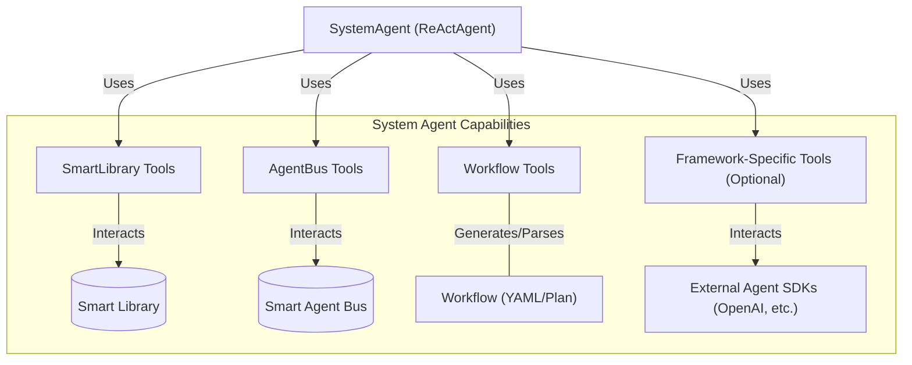
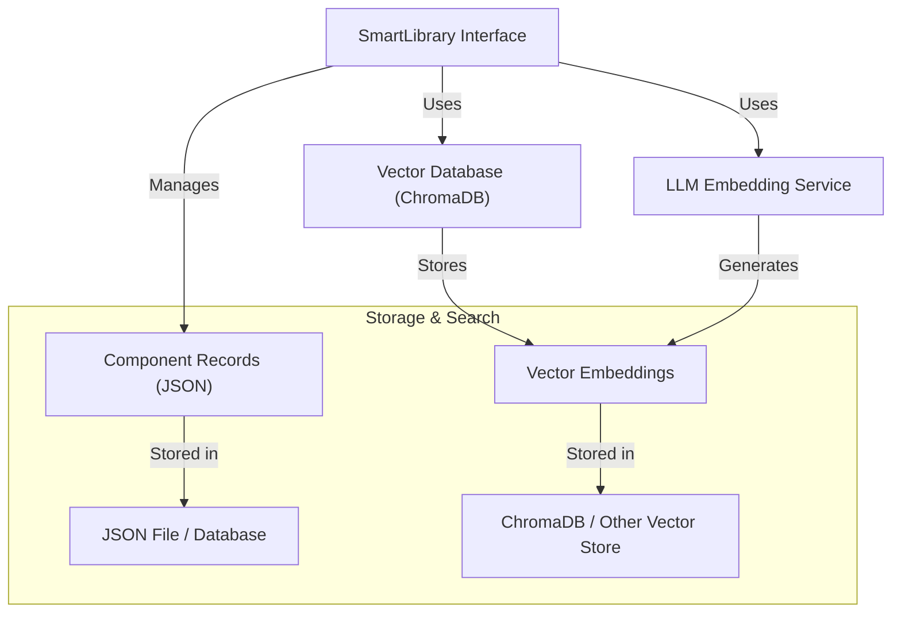
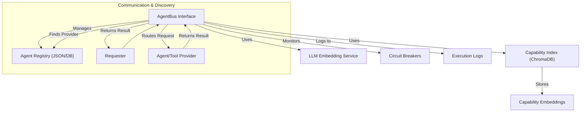
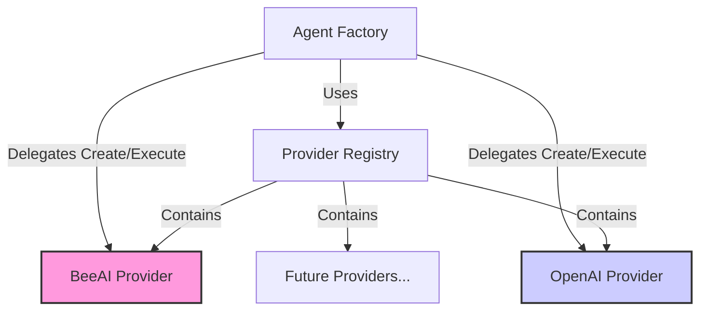
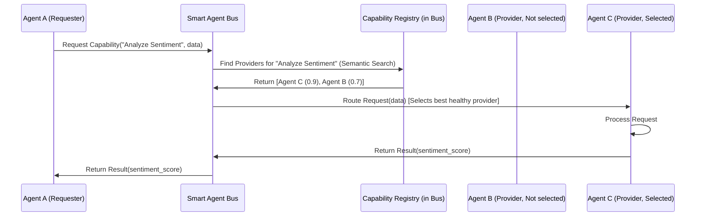
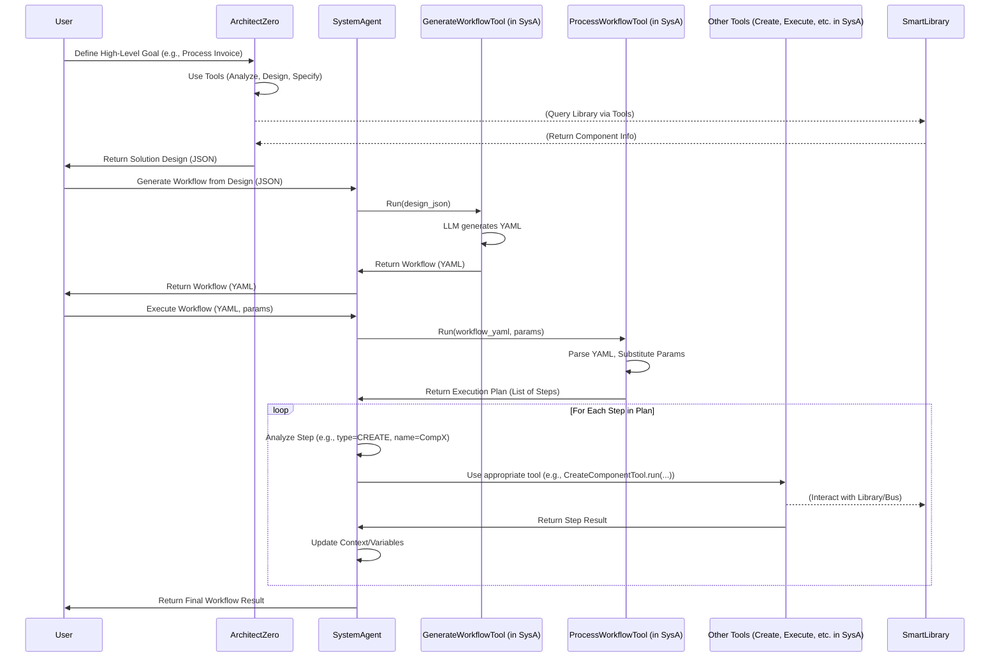
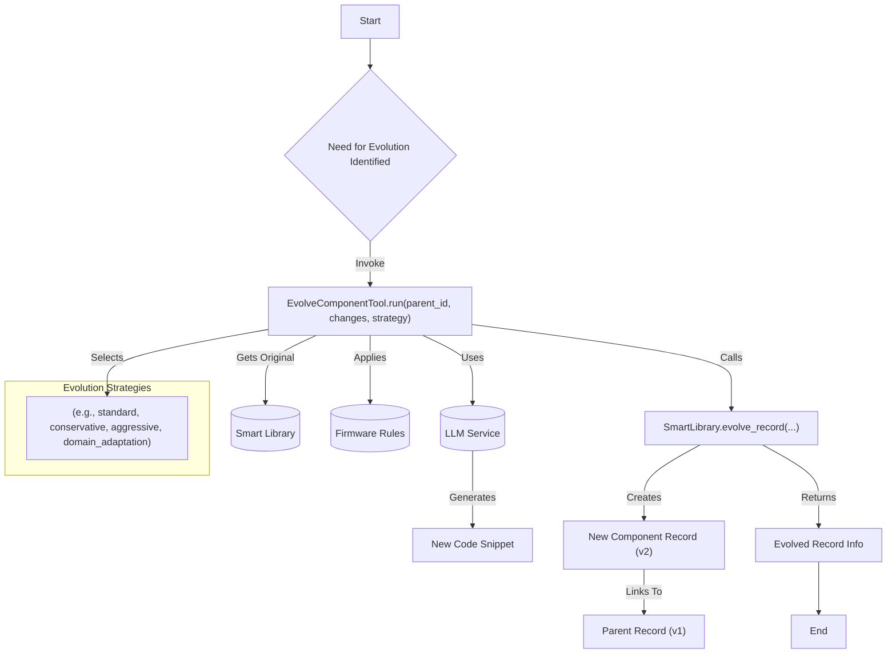

# Evolving Agents Toolkit - Architecture

This document details the architectural design of the Evolving Agents Toolkit, focusing on its core components, interactions, and design philosophy.

## 1. Introduction & Philosophy

The Evolving Agents Toolkit aims to provide a robust framework for building *ecosystems* of autonomous AI agents, rather than just individual agents. The core philosophy is **agent-centric**: the system itself is managed and orchestrated by specialized agents (like the `SystemAgent`), which leverage tools to interact with underlying services and manage other components.

Key goals of the architecture include:

*   **Autonomy & Evolution:** Enable agents and components to be created, evaluated, and improved over time, potentially automatically.
*   **Modularity & Reusability:** Promote the reuse of components (agents, tools) through discovery and adaptation via the `SmartLibrary`.
*   **Interoperability:** Support agents and tools built with different underlying frameworks (e.g., BeeAI, OpenAI Agents SDK) through a provider pattern.
*   **Decoupled Communication:** Facilitate communication based on *capabilities* rather than direct references using the `SmartAgentBus`.
*   **Governance & Safety:** Embed safety and ethical considerations through `Firmware` and guardrails.
*   **Orchestration:** Provide mechanisms for defining and executing complex, multi-step tasks involving multiple agents and tools via workflows managed by the `SystemAgent`.

## 2. Core Components

The toolkit is composed of several key interacting components:

### 2.1. SystemAgent

The central orchestrator of the ecosystem.

*   **Implementation:** A `beeai_framework.agents.react.ReActAgent`.
*   **Role:** Manages the agent lifecycle, component interactions, and workflow execution. It doesn't contain business logic itself but uses specialized tools to interact with other parts of the system.
*   **Key Tools:**
    *   **SmartLibrary Tools:** `SearchComponentTool`, `CreateComponentTool`, `EvolveComponentTool` for managing components.
    *   **AgentBus Tools:** `RegisterAgentTool`, `RequestAgentTool`, `DiscoverAgentTool` for managing agent registration and communication.
    *   **Workflow Tools:** `GenerateWorkflowTool`, `ProcessWorkflowTool` for creating and preparing workflows for execution.
    *   **(Optional) Framework-Specific Tools:** Tools for interacting directly with specific frameworks (e.g., `CreateOpenAIAgentTool`, `EvolveOpenAIAgentTool`).

### 2.2. ArchitectZero Agent

A specialized agent responsible for *designing* solutions.

*   **Implementation:** Typically a `ReActAgent` (as shown in `agents/architect_zero.py`).
*   **Role:** Analyzes high-level requirements, queries the `SmartLibrary` (often via the `SystemAgent` or its own tools if configured), designs multi-component solutions, and specifies components.
*   **Output:** Produces a structured *solution design* (e.g., JSON), which includes component specifications and a logical workflow sequence. It **does not** directly generate executable YAML or code itself in the refactored design.
*   **Key Tools (Internal):** `AnalyzeRequirementsTool`, `DesignSolutionTool`, `ComponentSpecificationTool`.

### 2.3. Smart Library

The persistent storage and discovery mechanism for all reusable components.

*   **Stores:** Agents, Tools, Firmware definitions as structured records (typically JSON).
*   **Discovery:** Supports keyword and **semantic search** (via vector embeddings, using ChromaDB by default) to find components based on natural language descriptions of required capabilities.
*   **Versioning & Evolution:** Tracks component versions and parentage, facilitating evolution (`evolve_record`).
*   **Interface:** Provides methods like `create_record`, `find_record_by_id`, `semantic_search`, `evolve_record`.
*   **Backends:** Pluggable storage (JSON file default) and vector database (ChromaDB default).

### 2.4. Smart Agent Bus (Service Bus)

Manages inter-agent communication and capability discovery/execution.

*   **Role:** Acts as a central "nervous system" allowing agents to request services based on capability descriptions rather than specific agent names.
*   **Discovery:** Uses semantic matching (via embeddings generated by `LLMService`) to find registered providers (agents/tools) that match a requested capability query.
*   **Routing:** Directs requests to the best-matching, healthy provider.
*   **Resilience:** Implements circuit breakers to temporarily disable failing providers.
*   **Monitoring:** Logs agent executions and interactions.
*   **Interface:** `register_agent`, `discover_agents`, `request_capability`.

### 2.5. Providers & Agent Factory

Abstract interaction with different underlying agent frameworks.

*   **`FrameworkProvider` (Abstract Base Class):** Defines the interface (`create_agent`, `execute_agent`, `supports_framework`) that concrete providers (e.g., `BeeAIProvider`, `OpenAIAgentsProvider`) must implement.
*   **`ProviderRegistry`:** Holds instances of available providers.
*   **`AgentFactory`:** Uses the `ProviderRegistry` to find the correct provider for a given framework and delegates agent creation/execution to that provider. This allows the rest of the system (like the `SystemAgent`'s `CreateComponentTool`) to work with agents generically.

### 2.6. Dependency Container

Manages the instantiation and wiring of core components.

*   **Role:** Handles dependency injection to avoid circular imports and manage the initialization lifecycle (Register, Wire, Init phases). Ensures components like `SmartLibrary`, `AgentBus`, `LLMService`, `SystemAgent` receive their required dependencies.

### 2.7. Firmware

Provides governance rules and operational constraints.

*   **Role:** Injects safety guidelines, ethical constraints, and domain-specific rules into agents and tools during creation or evolution.
*   **Mechanism:** Typically provides prompts or configuration data used by `CreateComponentTool`, `EvolveComponentTool`, and framework providers (e.g., via `OpenAIGuardrailsAdapter`).

### 2.8. Adapters

Bridge different interfaces or formats.

*   **`OpenAIGuardrailsAdapter`:** Converts `Firmware` rules into OpenAI Agents SDK guardrail functions.
*   **`OpenAIToolAdapter`:** Converts Evolving Agents/BeeAI tools into a format compatible with the OpenAI Agents SDK `function_tool`.
*   **`OpenAITracingAdapter`:** (Optional) Integrates OpenAI Agents SDK tracing with the toolkit's monitoring.

## 3. Key Architectural Patterns & Flows

### 3.1. Agent-Centric Communication (via Agent Bus)

Agents interact based on *what* needs to be done, not *who* does it.

### 3.2. Workflow Generation & Execution

Workflows are designed, generated, and executed through agent interactions.

1.  **Design:** `ArchitectZero` analyzes requirements and produces a detailed *solution design* (JSON), specifying components and logical steps.
2.  **Generation:** The `SystemAgent` is prompted with the *solution design*. It uses its `GenerateWorkflowTool` (which internally uses an LLM) to translate the design into an executable YAML workflow string.
3.  **Processing:** The `SystemAgent` is prompted to execute the YAML. It first uses its `ProcessWorkflowTool` to parse the YAML, validate steps, and substitute parameters, resulting in a structured *execution plan* (list of steps).
4.  **Execution:** The `SystemAgent`'s `ReAct` loop iterates through the execution plan. For each step, it uses the appropriate tool (`CreateComponentTool`, `EvolveComponentTool`, `RequestAgentTool`, etc.) to perform the action defined in the step. Data is passed between steps using variables managed within the agent's execution context.

### 3.3. Component Evolution

Components can be improved or adapted.

1.  User or an agent (like `SystemAgent`) identifies a need to evolve a component (e.g., `ComponentA_v1`).
2.  The `EvolveComponentTool` is invoked with the `parent_id`, description of `changes`, and potentially `new_requirements` and an `evolution_strategy`.
3.  The tool uses the `LLMService` to generate a new `code_snippet` based on the original code, changes, strategy, and firmware.
4.  The tool calls `SmartLibrary.evolve_record` to create a new record (`ComponentA_v2`) linked to the parent, saving the new code and incrementing the version.

### 3.4. Dependency Injection & Initialization

Managed by the `DependencyContainer`.

1.  **Registration Phase:** Core components (`LLMService`, `SmartLibrary`, `AgentBus`, `SystemAgent`, `ArchitectZero`, etc.) are instantiated and registered with the container.
2.  **Wiring Phase (Implicit/Explicit):** Dependencies are resolved. For example, when `SystemAgent` is created, the factory gets `LLMService`, `SmartLibrary`, `AgentBus` from the container.
3.  **Initialization Phase:** Components perform setup that requires their dependencies to be present (e.g., `AgentBus.initialize_from_library` is called after the `SmartLibrary` and `SystemAgent` are available).

## 4. Multi-Framework Integration

The Provider pattern is key to supporting different agent frameworks.

*   `AgentFactory` uses `ProviderRegistry` to select the correct `FrameworkProvider`.
*   The `FrameworkProvider` handles framework-specific details of agent creation (e.g., initializing `beeai_framework.ReActAgent` vs. `agents.Agent`) and execution.
*   `Adapters` help bridge specific components like tools (`OpenAIToolAdapter`) and governance (`OpenAIGuardrailsAdapter`) between the toolkit's concepts and the specific SDK requirements.

## 5. Governance and Safety

Integrated via the `Firmware` component.

*   Provides baseline ethical and safety rules.
*   Allows defining domain-specific constraints (medical, finance).
*   Rules are injected into prompts during component creation/evolution.
*   Guardrails (especially for OpenAI Agents via the adapter) enforce rules at runtime.
*   `AgentBus` circuit breakers prevent cascading failures.

This architecture promotes a flexible, extensible, and governable system for building complex AI agent solutions capable of adaptation and self-improvement.