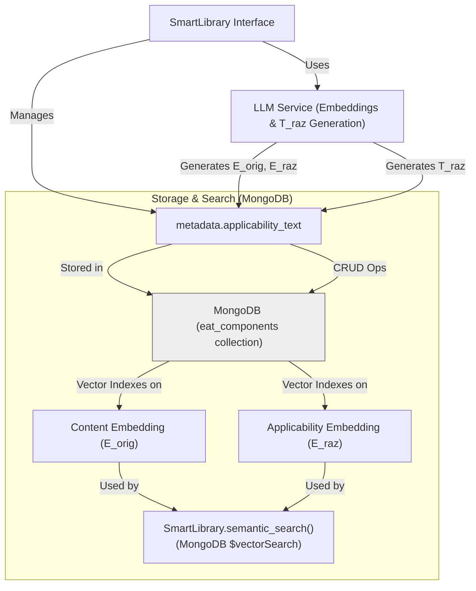
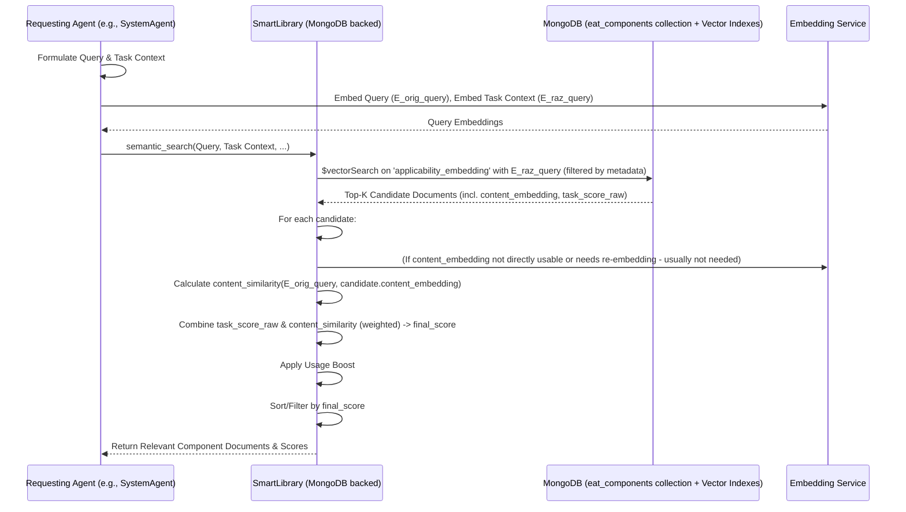
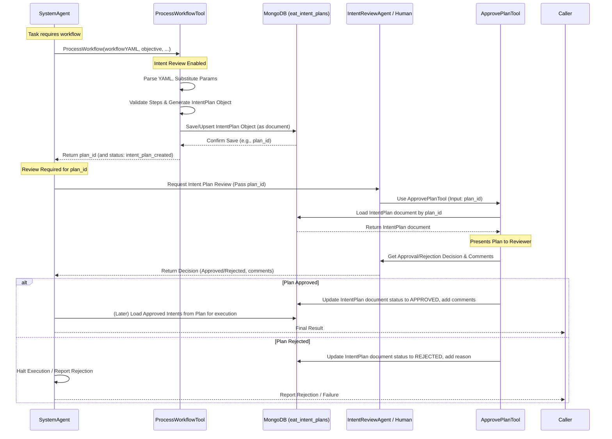
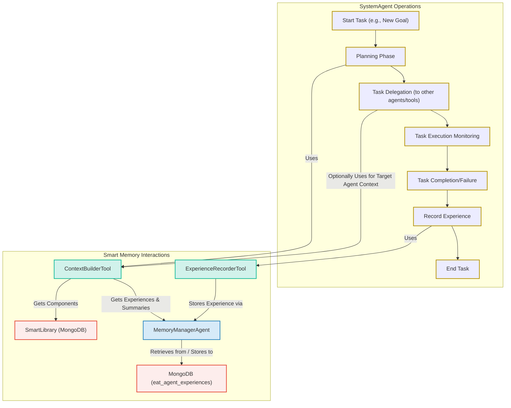

# Evolving Agents Toolkit - Architecture

This document details the architectural design of the Evolving Agents Toolkit (EAT), focusing on its core components, interactions, and its unified **MongoDB backend**.

## 1. Introduction & Philosophy

The Evolving Agents Toolkit aims to provide a robust framework for building *ecosystems* of autonomous AI agents. The core philosophy is **agent-centric**: the system itself is managed and orchestrated by specialized agents (like the `SystemAgent`), which leverage tools to interact with underlying services and manage other components. All primary data, including component metadata, embeddings, agent registrations, logs, and caches, is now persisted in **MongoDB**.

Key goals of the architecture include:

*   **Autonomy & Evolution:** Enable agents and components to be created, evaluated, and improved over time.
*   **Modularity & Reusability:** Promote component reuse through discovery and adaptation via the `SmartLibrary` (backed by MongoDB).
*   **Interoperability:** Support agents and tools built with different underlying frameworks through a provider pattern.
*   **Decoupled Communication:** Facilitate capability-based communication via the `SmartAgentBus` (registry in MongoDB).
*   **Governance & Safety:** Embed safety through `Firmware` and an optional human-in-the-loop review process (IntentPlans in MongoDB).
*   **Task-Relevant Context:** Provide agents with task-specific context using the Dual Embedding Strategy in `SmartLibrary` (embeddings stored in MongoDB, search via Atlas Vector Search or equivalent).
*   **Orchestration:** Enable complex goal achievement through `SystemAgent`-driven internal workflow generation and execution.
*   **Unified & Scalable Backend:** Utilize MongoDB for all persistent data, enhancing scalability, data consistency, and querying capabilities.

## 2. Core Components

The toolkit is composed of several key interacting components, all leveraging MongoDB for persistence where applicable.

### 2.1. SystemAgent

The central orchestrator, a `beeai_framework.agents.react.ReActAgent`.
*   **Role:** Manages component lifecycles (search, create, evolve via tools that interact with the MongoDB-backed `SmartLibrary`), facilitates communication (via `SmartAgentBus` tools), and handles complex task execution. Uses `SmartContext` and task-aware search (via `SmartLibrary`'s MongoDB vector search). When Intent Review is enabled, `ProcessWorkflowTool` generates an `IntentPlan` (stored in MongoDB) for review by `ApprovePlanTool` before execution.
*   **Key Tools:**
    *   **SmartLibrary Tools:** `SearchComponentTool`, `CreateComponentTool`, `EvolveComponentTool`, `TaskContextTool`, `ContextualSearchTool`.
    *   **AgentBus Tools:** `RegisterAgentTool`, `RequestAgentTool`, `DiscoverAgentTool`.
    *   **Workflow Tools (Internal):** `GenerateWorkflowTool`, `ProcessWorkflowTool`.
    *   **Intent Review Tools (Optional):** `WorkflowDesignReviewTool`, `ComponentSelectionReviewTool`, `ApprovePlanTool`.

### 2.2. ArchitectZero Agent

A specialized `ReActAgent` for designing solutions, invoked by `SystemAgent` via `SmartAgentBus`.
*   **Role:** Analyzes requirements, queries the `SmartLibrary` (MongoDB), and designs multi-component solutions.
*   **Output:** A structured solution design (JSON) for `SystemAgent`.

### 2.3. Smart Library (MongoDB Backend)

Persistent storage and discovery for reusable components (agents, tools, firmware).
*   **MongoDB Collection:** `eat_components` (or configurable name).
*   **Stores:** Each component as a MongoDB document including its `id`, `name`, `record_type`, `domain`, `description`, `code_snippet`, `version`, `tags`, `metadata` (like `applicability_text`), and crucially, its `content_embedding` (E_orig) and `applicability_embedding` (E_raz).
*   **Discovery (Dual Embedding on MongoDB):**
    *   Uses **MongoDB Atlas Vector Search** (or equivalent) on the `content_embedding` and `applicability_embedding` fields within the `eat_components` collection.
    *   Supports **Task-Aware Semantic Search**: Primarily queries against `applicability_embedding` using task context, then refines using `content_embedding` similarity.
*   **Versioning & Evolution:** Tracks component versions and parentage within MongoDB documents.
*   **Interface:** Methods like `create_record`, `find_record_by_id`, `semantic_search`, `evolve_record` now perform CRUD and search operations against MongoDB.
*   **Indexing Pipeline:** When records are created/updated:
    *   `T_orig` (functional text from `_get_record_vector_text`) is embedded to get `content_embedding`.
    *   `T_raz` (applicability text from `generate_applicability_text` via `LLMService`) is generated and embedded to get `applicability_embedding`.
    *   Both embeddings and `T_raz` (in metadata) are stored directly in the component's MongoDB document.


*Diagram Note: ChromaDB removed, MongoDB is the backend for both records and vector search.*

### 2.4. Smart Agent Bus (MongoDB Backend)

Manages inter-agent communication and capability discovery.
*   **Agent Registry (MongoDB Collection):** `eat_agent_registry`. Stores agent registration documents (id, name, capabilities, status, etc.).
    *   Optionally, capability descriptions can be embedded (`capability_description_embedding`) and stored here for semantic discovery of capabilities using MongoDB Vector Search.
*   **Execution Logs (MongoDB Collection):** `eat_agent_bus_logs`. Stores logs of System and Data Bus operations.
*   **Role:** Central nervous system for capability-based requests.
*   **Discovery:**
    *   Finds registered agents based on `capability_id` (metadata query on `eat_agent_registry`).
    *   For `task_description`-based discovery, it can query agent descriptions (potentially with vector search on `description_embedding` in `eat_agent_registry`) or leverage `SmartLibrary` to find agent *components* suitable for the task.
*   **Resilience:** Circuit breakers (currently file-based, future MongoDB).
*   **Interface:** `register_agent`, `discover_agents`, `request_capability`, etc., now interact with MongoDB.

```mermaid
graph TD
    SABI["AgentBus Interface"] -->|Manages| Reg["Agent Registry (MongoDB 'eat_agent_registry')"]
    SABI -->|Logs to| ExecLogs["Execution Logs (MongoDB 'eat_agent_bus_logs')"]
    SABI -->|Uses for Discovery| LLMS["LLM Service (for embedding query if vector searching descriptions)"]
    SABI -->|Monitors| CB["Circuit Breakers (File-based)"]

    Reg -- Optional Vector Index on --> AgentDescEmbeds["Agent Description Embeddings"]
    Reg -- Optional Vector Index on --> CapEmbeds["Capability Description Embeddings"]


    subgraph "Data Bus Communication (request_capability)"
        direction LR
        Requester --> SABI
        SABI -->|Finds Provider (Queries Reg)| Reg
        SABI -->|Routes Request| Provider["Agent/Tool Instance"]
        Provider -->|Returns Result| SABI
        SABI -->|Returns Result| Requester
    end
```
*Diagram Note: Capability Index (ChromaDB) removed. Discovery uses MongoDB queries (metadata or vector).*

### 2.5. Smart Context

Data structure for passing task-relevant information.
*   **Role:** Carries task data, user input, intermediate results, and current task context description.
*   **Interaction with `SmartLibrary`:** The `current_task` description it holds is used by `SmartLibrary.semantic_search` to leverage the dual embeddings (E_raz) stored in MongoDB for task-aware retrieval.

### 2.6. Providers & Agent Factory

Abstracts interaction with different agent frameworks. (Functionality remains, dependencies updated).

### 2.7. Dependency Container

Manages instantiation and wiring of core components, including the `MongoDBClient`.

### 2.8. LLM Service (MongoDB Cache)

Provides LLM interfaces for generation and embeddings.
*   **Caching:** Now uses an `LLMCache` class that stores completions and embeddings in a MongoDB collection (`eat_llm_cache`) with TTL (Time-To-Live) indexes for automatic expiration.

### 2.9. Firmware

Provides governance rules. (No direct change in persistence mechanism).

### 2.10. Adapters

Bridge different interfaces. (No direct change in persistence mechanism).

### 2.11. Intent Review System (MongoDB Backend)

Optional human-in-the-loop review.
*   **`IntentPlan` Storage (MongoDB Collection):** `eat_intent_plans`. `ProcessWorkflowTool` generates `IntentPlan` objects which are serialized and stored in this MongoDB collection. `ApprovePlanTool` loads them from MongoDB for review and updates their status in the database.
*   `IntentReviewAgent` and review tools (`WorkflowDesignReviewTool`, `ComponentSelectionReviewTool`, `ApprovePlanTool`) interact with these persisted plans.

## 2.12. Smart Memory Ecosystem

The Smart Memory Ecosystem provides persistent, queryable long-term memory for agents, enabling them to learn from past workflows, decisions, and outcomes. This system enhances agent performance by allowing them to retrieve relevant past experiences to inform current task execution and to record new experiences for future learning. It adheres to the EAT philosophy where core functionalities are often managed by specialized agents and tools.

### 2.12.1. Core Components

*   **`MemoryManagerAgent`**:
    *   **Role:** The central agent responsible for all memory operations. It is registered on the `SmartAgentBus` and acts as the single point of contact for storing and retrieving persistent agent experiences.
    *   **Capabilities:**
        *   `store_agent_experience`: Stores a structured record of a completed agent task or workflow.
        *   `retrieve_relevant_experiences`: Retrieves past agent experiences relevant to a given goal or sub-task description using semantic search on stored embeddings.
        *   `summarize_message_history`: Summarizes a list of messages, focusing on relevance to a target goal (though this capability might be more for direct use by other agents rather than just an internal function for context building).
    *   **Internal Tools:**
        *   `MongoExperienceStoreTool`: Handles the direct interaction with the `eat_agent_experiences` MongoDB collection, including storing data, generating embeddings for specified text fields (via `LLMService`), and performing vector searches.
        *   `MessageSummarizationTool`: Uses `LLMService` to summarize message histories.

*   **`ContextBuilderTool`**:
    *   **Role:** A tool designed primarily for use by `SystemAgent` (or other orchestrator agents) to construct rich, task-specific `SmartContext` objects.
    *   **Inputs:** Typically takes `target_agent_id`, `assigned_sub_task_goal_description`, the current `workflow_context` (a `SmartContext` object), and optional limits for data retrieval.
    *   **Outputs:** A new `SmartContext` object populated with:
        *   **Relevant Past Experiences:** Retrieved by querying the `MemoryManagerAgent.retrieve_relevant_experiences` capability.
        *   **Summarized Message History:** Generated by querying `MemoryManagerAgent.summarize_message_history` (using recent messages from the input `workflow_context`).
        *   **Relevant Library Components:** Retrieved by querying `SmartLibrary.semantic_search` (via its `SearchComponentTool`).
    *   **Interaction:** Orchestrates calls to `MemoryManagerAgent` (for experiences and summaries) and `SmartLibrary` (for components).

*   **`ExperienceRecorderTool`**:
    *   **Role:** A tool designed for `SystemAgent` (or other agents managing task execution) to record the details and outcome of a completed task or workflow into the persistent memory.
    *   **Functionality:** It structures the provided information (goals, components used, decisions, outcomes, feedback, etc.) into the schema expected by `MemoryManagerAgent` and then calls `MemoryManagerAgent.store_agent_experience` capability.

### 2.12.2. MongoDB Collection: `eat_agent_experiences`

*   **Purpose:** Stores detailed records of completed agent tasks, workflows, and significant interactions. This data serves as the long-term memory for agents, enabling learning and adaptation over time.
*   **Schema:**
    *   `experience_id` (String, UUID): Unique identifier for the experience record.
    *   `timestamp` (ISODate): Timestamp of when the experience was recorded.
    *   `primary_goal_description` (String): The main goal of the task/workflow.
    *   `primary_goal_description_embedding` (Array[Float]): Embedding of the primary goal description.
    *   `sub_task_description` (String, Optional): Specific sub-task description, if applicable.
    *   `sub_task_description_embedding` (Array[Float], Optional): Embedding of the sub-task description.
    *   `involved_components` (Array[Object], Optional): List of components used.
        *   `component_id` (String)
        *   `component_name` (String)
        *   `component_type` (String, e.g., "AGENT", "TOOL", "SERVICE")
        *   `usage_description` (String)
    *   `input_context_summary` (String, Optional): Summary of the initial context/inputs.
    *   `input_context_summary_embedding` (Array[Float], Optional): Embedding of the input context summary.
    *   `key_decisions_made` (Array[Object], Optional): Significant decisions made during the task.
        *   `decision_summary` (String)
        *   `decision_reasoning` (String, Optional)
        *   `timestamp` (ISODate, Optional)
    *   `status` (String): Outcome of the task (e.g., "success", "failure", "partial_success").
    *   `status_reason` (String, Optional): Explanation for the status.
    *   `output_summary` (String, Optional): Summary of the final output or result.
    *   `output_summary_embedding` (Array[Float], Optional): Embedding of the output summary.
    *   `error_summary` (String, Optional): Summary of any errors encountered. Used if status is "failure".
    *   `error_summary_embedding` (Array[Float], Optional): Embedding of the error summary.
    *   `feedback` (Array[Object], Optional): Feedback received regarding the task/outcome.
        *   `feedback_source` (String)
        *   `feedback_content` (String)
        *   `feedback_rating` (Float, Optional)
        *   `timestamp` (ISODate, Optional)
    *   `tags` (Array[String], Optional): Keywords for categorization and search.
    *   `agent_version` (String, Optional): Version of the agent that performed/recorded the task.
    *   `tool_versions` (Array[Object], Optional): Versions of tools used.
        *   `tool_name` (String)
        *   `version` (String)
    *   `session_id` (String, Optional): Identifier for a user session or a related series of tasks.
    *   `run_id` (String, Optional): Identifier for a specific execution run.
    *   `initiating_agent_id` (String, Optional): ID of the agent that initiated or was primarily responsible for the task leading to this experience.

*   **Vector Search Indexes (MongoDB Atlas Requirement):**
    For `MemoryManagerAgent.retrieve_relevant_experiences` to function effectively using semantic search, vector search indexes must be configured in MongoDB Atlas on the `eat_agent_experiences` collection.
    *   **Index Configuration:** Each embedding field that needs to be searched requires its own vector search index definition or to be part of a composite vector index strategy.
    *   **Example Index Definitions:**
        *   `idx_exp_primary_goal`: On field `primary_goal_description_embedding`.
        *   `idx_exp_sub_task`: On field `sub_task_description_embedding`.
        *   `idx_exp_input_context`: On field `input_context_summary_embedding`.
        *   `idx_exp_output_summary`: On field `output_summary_embedding`.
        *   `idx_exp_error_summary`: On field `error_summary_embedding`.
    *   **Critical Settings:**
        *   **Dimensions:** The number of dimensions must match the output dimensions of the embedding model used by `LLMService`.
        *   **Similarity Metric:** The similarity metric (e.g., `cosine`, `euclidean`, `dotProduct`) must also align with the one appropriate for the embeddings generated by `LLMService`.
    *   **Setup:** These indexes are typically created manually via the MongoDB Atlas UI or its API, as part of the deployment setup for the EAT environment.

### 2.12.3. MongoDB Collection: `eat_contextual_facts` (Deferred)

The concept of a separate collection for storing discrete, verifiable "contextual facts" was considered as part of the Smart Memory system. These facts would be smaller, atomic pieces of information that agents could assert or retrieve. However, its implementation and detailed schema definition have been deferred to simplify the initial rollout of the Smart Memory Ecosystem, which primarily focuses on experiential learning via `eat_agent_experiences`. Future iterations may revisit the need for this dedicated collection.


## 3. Key Architectural Patterns & Flows

### 3.1. Agent Communication (via Agent Bus)

Remains conceptually the same, but the `SmartAgentBus` now uses MongoDB for its registry. Discovery might involve MongoDB vector search if agent/capability descriptions are embedded and indexed.

### 3.2. Task-Aware Context Retrieval (Dual Embedding on MongoDB)

The core logic is similar, but the implementation shifts to MongoDB:
1.  **Query Formulation:** Agent forms `query` and `task_context`.
2.  **Query Embedding:** `LLMService` embeds both.
3.  **Applicability Search (MongoDB `$vectorSearch`):** `SmartLibrary.semantic_search` uses the `task_context` embedding to query the `applicability_embedding` field in the `eat_components` MongoDB collection via Atlas Vector Search (or equivalent). This retrieves candidate component documents.
4.  **Refinement & Scoring (Client-Side or Hybrid):**
    *   The `content_embedding` for candidate documents can be retrieved.
    *   Client-side: Similarity between `query_embedding` and candidate `content_embedding` is calculated.
    *   Scores are combined (task_weight, usage boost) to get a `final_score`.
    *   Alternatively, more complex MongoDB aggregation pipelines might combine vector scores with other field matches.
5.  **Content Retrieval:** The relevant fields (like `code_snippet` for `T_orig`) are already part of the retrieved MongoDB documents.



### 3.3. Workflow Generation & Execution

Conceptually similar. `ProcessWorkflowTool` now generates an `IntentPlan` object and, if review is enabled, saves its dictionary representation to the `eat_intent_plans` MongoDB collection.

### 3.4. Component Evolution

Conceptually similar. `EvolveComponentTool` uses `SmartLibrary.evolve_record`, which now creates a new versioned document in the `eat_components` MongoDB collection, including newly generated embeddings.

### 3.5. Dependency Injection & Initialization

`DependencyContainer` now also manages the `MongoDBClient` instance. Initialization includes ensuring MongoDB indexes are created.

### 3.6. Intent Review / Human-in-the-Loop Flow (MongoDB Backend)

1.  **Design Review (Optional):** Same flow, design is an in-memory object.
2.  **Component Selection Review (Optional):** Same flow, component list is in-memory.
3.  **Intent Plan Generation & Persistence:** `ProcessWorkflowTool` generates an `IntentPlan` object and saves it to the `eat_intent_plans` MongoDB collection. It returns the `plan_id`.
4.  **Intent Plan Review (Core):** `ApprovePlanTool` receives the `plan_id`, loads the `IntentPlan` from MongoDB, facilitates review, and then updates the plan's status and review details directly in its MongoDB document.
5.  **Execution:** `SystemAgent` would (after approval) load the approved `IntentPlan` (or its steps) from MongoDB to guide execution.



## 4. Multi-Framework Integration

Provider pattern remains key. No direct impact from MongoDB change on this abstraction.

## 5. Governance and Safety

Conceptually similar, but `IntentPlan` persistence in MongoDB enhances auditability and traceability of reviewed decisions. The Smart Memory system also contributes to governance by providing a record of past actions and their outcomes.

## 6. Smart Memory Workflow Integration

The Smart Memory ecosystem is integrated into the `SystemAgent`'s operational loop to enhance its planning, execution, and learning capabilities.



**Workflow Description:**

1.  **Planning Phase (Context Building):**
    *   When `SystemAgent` receives a new complex goal, before detailed planning (e.g., before using `GenerateWorkflowTool`), it can use the `ContextBuilderTool`.
    *   `ContextBuilderTool` queries `MemoryManagerAgent` for relevant past experiences and message summaries, and `SmartLibrary` for relevant components.
    *   The resulting `SmartContext` (rich with historical and component information) informs the `SystemAgent`'s planning process, leading to more robust and contextually aware plans.

2.  **Task Delegation (Contextualization for Worker Agents):**
    *   When `SystemAgent` delegates a sub-task to another agent, it can again use `ContextBuilderTool` to create a specific `SmartContext` tailored for that sub-task and the target worker agent.
    *   This `SmartContext` is then passed to the worker agent, providing it with pre-processed, relevant information, reducing its need for redundant information gathering.

3.  **Task Completion (Experience Recording):**
    *   After a significant task or workflow concludes (successfully or not), `SystemAgent` uses the `ExperienceRecorderTool`.
    *   `ExperienceRecorderTool` structures the details of the task (goals, components used, decisions made, final outcome, feedback, etc.) and sends this information to `MemoryManagerAgent` to be stored in the `eat_agent_experiences` collection.
    *   This recorded experience becomes available for future learning and context building.

This MongoDB-centric architecture, now including the Smart Memory Ecosystem, simplifies the EAT data layer, improves data consistency, and leverages MongoDB's strengths for both structured data and vector search, paving the way for enhanced scalability, learning, and more complex data interactions within the agent ecosystem.