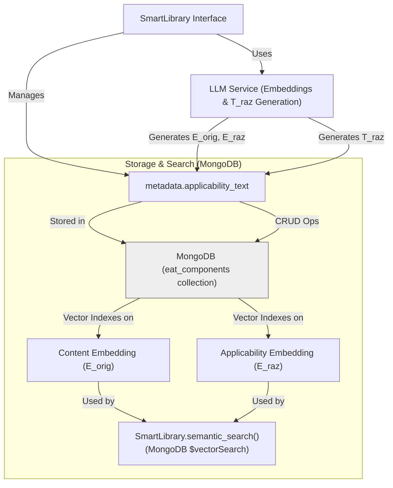
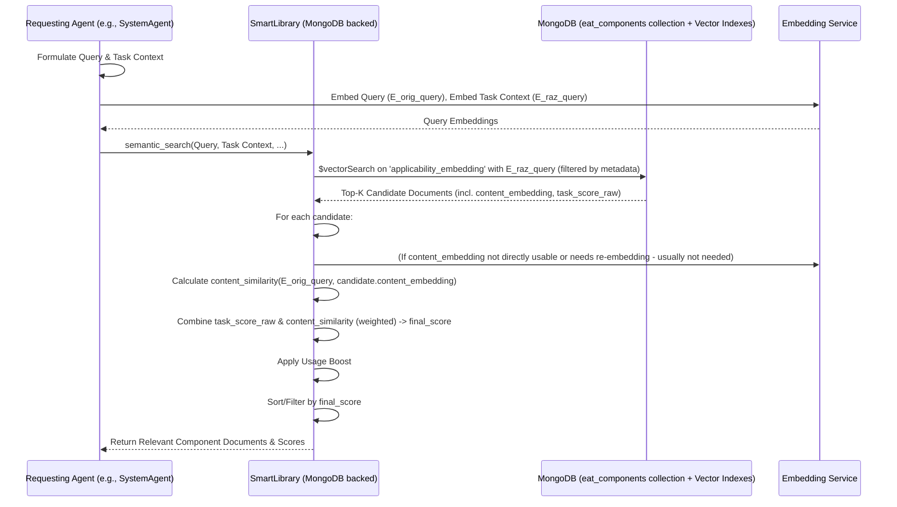
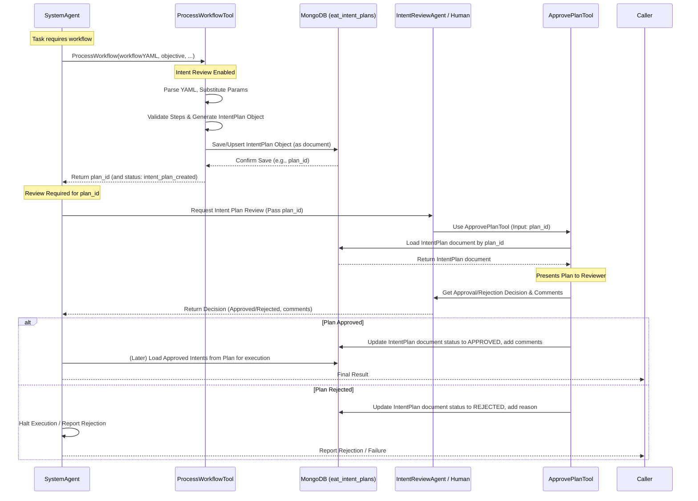

# Evolving Agents Toolkit - Architecture

This document details the architectural design of the Evolving Agents Toolkit (EAT), focusing on its core components, interactions, and its unified **MongoDB backend**.

## 1. Introduction & Philosophy

The Evolving Agents Toolkit aims to provide a robust framework for building *ecosystems* of autonomous AI agents. The core philosophy is **agent-centric**: the system itself is managed and orchestrated by specialized agents (like the `SystemAgent`), which leverage tools to interact with underlying services and manage other components. All primary data, including component metadata, embeddings, agent registrations, logs, and caches, is now persisted in **MongoDB**.

Key goals of the architecture include:

*   **Autonomy & Evolution:** Enable agents and components to be created, evaluated, and improved over time.
*   **Modularity & Reusability:** Promote component reuse through discovery and adaptation via the `SmartLibrary` (backed by MongoDB).
*   **Interoperability:** Support agents and tools built with different underlying frameworks through a provider pattern.
*   **Decoupled Communication:** Facilitate capability-based communication via the `SmartAgentBus` (registry in MongoDB).
*   **Governance & Safety:** Embed safety through `Firmware` and an optional human-in-the-loop review process (IntentPlans in MongoDB).
*   **Task-Relevant Context:** Provide agents with task-specific context using the Dual Embedding Strategy in `SmartLibrary` (embeddings stored in MongoDB, search via Atlas Vector Search or equivalent).
*   **Orchestration:** Enable complex goal achievement through `SystemAgent`-driven internal workflow generation and execution.
*   **Cumulative Learning:** Enable agents to learn from past workflows, decisions, and outcomes through a persistent Smart Memory system.
*   **Unified & Scalable Backend:** Utilize MongoDB for all persistent data, enhancing scalability, data consistency, and querying capabilities.

A new Smart Memory ecosystem further enhances this by allowing agents to record and retrieve experiences, enriching their contextual understanding and decision-making capabilities over time.

## 2. Core Components

The toolkit is composed of several key interacting components, all leveraging MongoDB for persistence where applicable.

### 2.1. SystemAgent

The central orchestrator, a `beeai_framework.agents.react.ReActAgent`.
*   **Role:** Manages component lifecycles (search, create, evolve via tools that interact with the MongoDB-backed `SmartLibrary`), facilitates communication (via `SmartAgentBus` tools), and handles complex task execution. Uses `SmartContext` and task-aware search (via `SmartLibrary`'s MongoDB vector search). It actively utilizes the Smart Memory ecosystem via tools like ContextBuilderTool for enhanced planning and ExperienceRecorderTool to record significant outcomes, fostering continuous learning. When Intent Review is enabled, `ProcessWorkflowTool` generates an `IntentPlan` (stored in MongoDB) for review by `ApprovePlanTool` before execution.
*   **Key Tools:**
    *   **SmartLibrary Tools:** `SearchComponentTool`, `CreateComponentTool`, `EvolveComponentTool`, `TaskContextTool`, `ContextualSearchTool`.
    *   **AgentBus Tools:** `RegisterAgentTool`, `RequestAgentTool`, `DiscoverAgentTool`.
    *   **Workflow Tools (Internal):** `GenerateWorkflowTool`, `ProcessWorkflowTool`.
    *   **Intent Review Tools (Optional):** `WorkflowDesignReviewTool`, `ComponentSelectionReviewTool`, `ApprovePlanTool`.
    *   **Memory Tools:** `ContextBuilderTool`, `ExperienceRecorderTool`.

### 2.2. ArchitectZero Agent

A specialized `ReActAgent` for designing solutions, invoked by `SystemAgent` via `SmartAgentBus`.
*   **Role:** Analyzes requirements, queries the `SmartLibrary` (MongoDB), and designs multi-component solutions.
*   **Output:** A structured solution design (JSON) for `SystemAgent`.

### 2.3 Smart Memory Ecosystem

The Smart Memory ecosystem enables agents to learn from past interactions and build richer contexts. It revolves around the `MemoryManagerAgent` and specialized tools.

*   **`MemoryManagerAgent`**:
    *   **Role**: A `ReActAgent` acting as the central orchestrator for the storage and retrieval of long-term memories. It's registered on the `SmartAgentBus` (typically with ID `memory_manager_agent_default_id`) and exposes a general `process_task` capability. Other agents interact with it by sending natural language requests for memory operations (e.g., "store experience: {...}", "retrieve experiences related to: ...", "summarize messages: [...] for goal: ...").
    *   **Internal Tools**:
        *   `MongoExperienceStoreTool`: Handles CRUD operations for experiences in MongoDB, including embedding generation.
        *   `SemanticExperienceSearchTool`: Performs semantic searches over stored experiences.
        *   `MessageSummarizationTool`: Uses an LLM to summarize message histories relevant to a specific goal.

*   **`ContextBuilderTool` (Tool for `SystemAgent`)**:
    *   **Purpose**: Dynamically constructs an optimized `SmartContext` for a sub-task.
    *   **Functionality**: Invoked by `SystemAgent`, it uses `RequestAgentTool` (via `SmartAgentBus`) to call `MemoryManagerAgent` (to retrieve relevant past experiences and summarize message history) and also queries `SmartLibrary` for relevant components. It then assembles a new, lean `SmartContext` instance.

*   **`ExperienceRecorderTool` (Tool for `SystemAgent`)**:
    *   **Purpose**: Facilitates the recording of completed tasks/workflows as structured experiences.
    *   **Functionality**: Invoked by `SystemAgent`, it structures task details (goal, components, outcome, etc.) and uses `RequestAgentTool` (via `SmartAgentBus`) to call `MemoryManagerAgent` to persist the memory.

*   **MongoDB Collection: `eat_agent_experiences`**:
    *   **Purpose**: Stores structured records of completed tasks, workflows, and other notable agent experiences.
    *   **Key Fields**: Includes `experience_id`, `primary_goal_description` (embedded), `sub_task_description` (embedded), `input_context_summary` (embedded), `key_decisions_made`, `final_outcome`, `output_summary` (embedded), `feedback_signals`, `involved_components`, `timestamp`, and generated `embeddings` for searchable fields. (A detailed schema is maintained separately).

### 2.4. Smart Library (MongoDB Backend)

Persistent storage and discovery for reusable components (agents, tools, firmware).
*   **MongoDB Collection:** `eat_components` (or configurable name).
*   **Stores:** Each component as a MongoDB document including its `id`, `name`, `record_type`, `domain`, `description`, `code_snippet`, `version`, `tags`, `metadata` (like `applicability_text`), and crucially, its `content_embedding` (E_orig) and `applicability_embedding` (E_raz).
*   **Discovery (Dual Embedding on MongoDB):**
    *   Uses **MongoDB Atlas Vector Search** (or equivalent) on the `content_embedding` and `applicability_embedding` fields within the `eat_components` collection.
    *   Supports **Task-Aware Semantic Search**: Primarily queries against `applicability_embedding` using task context, then refines using `content_embedding` similarity.
*   **Versioning & Evolution:** Tracks component versions and parentage within MongoDB documents.
*   **Interface:** Methods like `create_record`, `find_record_by_id`, `semantic_search`, `evolve_record` now perform CRUD and search operations against MongoDB.
*   **Indexing Pipeline:** When records are created/updated:
    *   `T_orig` (functional text from `_get_record_vector_text`) is embedded to get `content_embedding`.
    *   `T_raz` (applicability text from `generate_applicability_text` via `LLMService`) is generated and embedded to get `applicability_embedding`.
    *   Both embeddings and `T_raz` (in metadata) are stored directly in the component's MongoDB document.


*Diagram Note: ChromaDB removed, MongoDB is the backend for both records and vector search.*

### 2.5. Smart Agent Bus (MongoDB Backend)

Manages inter-agent communication and capability discovery.
*   **Agent Registry (MongoDB Collection):** `eat_agent_registry`. Stores agent registration documents (id, name, capabilities, status, etc.). Key infrastructure agents like MemoryManagerAgent are registered here.
    *   Optionally, capability descriptions can be embedded (`capability_description_embedding`) and stored here for semantic discovery of capabilities using MongoDB Vector Search.
*   **Execution Logs (MongoDB Collection):** `eat_agent_bus_logs`. Stores logs of System and Data Bus operations.
*   **Role:** Central nervous system for capability-based requests.
*   **Discovery:**
    *   Finds registered agents based on `capability_id` (metadata query on `eat_agent_registry`).
    *   For `task_description`-based discovery, it can query agent descriptions (potentially with vector search on `description_embedding` in `eat_agent_registry`) or leverage `SmartLibrary` to find agent *components* suitable for the task.
*   **Resilience:** Circuit breakers (currently file-based, future MongoDB).
*   **Interface:** `register_agent`, `discover_agents`, `request_capability`, etc., now interact with MongoDB.

```mermaid
graph TD
    SABI["AgentBus Interface"] -->|Manages| Reg["Agent Registry (MongoDB 'eat_agent_registry')"]
    SABI -->|Logs to| ExecLogs["Execution Logs (MongoDB 'eat_agent_bus_logs')"]
    SABI -->|Uses for Discovery| LLMS["LLM Service (for embedding query if vector searching descriptions)"]
    SABI -->|Monitors| CB["Circuit Breakers (File-based)"]

    Reg -- Optional Vector Index on --> AgentDescEmbeds["Agent Description Embeddings"]
    Reg -- Optional Vector Index on --> CapEmbeds["Capability Description Embeddings"]


    subgraph "Data Bus Communication (request_capability)"
        direction LR
        Requester --> SABI
        SABI -->|Finds Provider (Queries Reg)| Reg
        SABI -->|Routes Request| Provider["Agent/Tool Instance"]
        Provider -->|Returns Result| SABI
        SABI -->|Returns Result| Requester
    end
```
*Diagram Note: Capability Index (ChromaDB) removed. Discovery uses MongoDB queries (metadata or vector).*

### 2.6. Smart Context

Data structure for passing task-relevant information.
*   **Role:** Carries task data, user input, intermediate results, and current task context description. It can be dynamically enriched by the ContextBuilderTool, which populates it with summaries of relevant past experiences and message histories retrieved via the MemoryManagerAgent, providing agents with deeper, historically-informed context for their current tasks.
*   **Interaction with `SmartLibrary`:** The `current_task` description it holds is used by `SmartLibrary.semantic_search` to leverage the dual embeddings (E_raz) stored in MongoDB for task-aware retrieval.

### 2.7. Providers & Agent Factory

Abstracts interaction with different agent frameworks. (Functionality remains, dependencies updated).

### 2.8. Dependency Container

Manages instantiation and wiring of core components, including the `MongoDBClient`.

### 2.9. LLM Service (MongoDB Cache)

Provides LLM interfaces for generation and embeddings.
*   **Caching:** Now uses an `LLMCache` class that stores completions and embeddings in a MongoDB collection (`eat_llm_cache`) with TTL (Time-To-Live) indexes for automatic expiration.

### 2.10. Firmware

Provides governance rules. (No direct change in persistence mechanism).

### 2.11. Adapters

Bridge different interfaces. (No direct change in persistence mechanism).

### 2.12. Intent Review System (MongoDB Backend)

Optional human-in-the-loop review.
*   **`IntentPlan` Storage (MongoDB Collection):** `eat_intent_plans`. `ProcessWorkflowTool` generates `IntentPlan` objects which are serialized and stored in this MongoDB collection. `ApprovePlanTool` loads them from MongoDB for review and updates their status in the database.
*   `IntentReviewAgent` and review tools (`WorkflowDesignReviewTool`, `ComponentSelectionReviewTool`, `ApprovePlanTool`) interact with these persisted plans.

## 3. Key Architectural Patterns & Flows

### 3.1. Agent Communication (via Agent Bus)

Remains conceptually the same, but the `SmartAgentBus` now uses MongoDB for its registry. Discovery might involve MongoDB vector search if agent/capability descriptions are embedded and indexed.

### 3.2. Task-Aware Context Retrieval (Dual Embedding on MongoDB)

The core logic is similar, but the implementation shifts to MongoDB:
1.  **Query Formulation:** Agent forms `query` and `task_context`.
2.  **Query Embedding:** `LLMService` embeds both.
3.  **Applicability Search (MongoDB `$vectorSearch`):** `SmartLibrary.semantic_search` uses the `task_context` embedding to query the `applicability_embedding` field in the `eat_components` MongoDB collection via Atlas Vector Search (or equivalent). This retrieves candidate component documents.
4.  **Refinement & Scoring (Client-Side or Hybrid):**
    *   The `content_embedding` for candidate documents can be retrieved.
    *   Client-side: Similarity between `query_embedding` and candidate `content_embedding` is calculated.
    *   Scores are combined (task_weight, usage boost) to get a `final_score`.
    *   Alternatively, more complex MongoDB aggregation pipelines might combine vector scores with other field matches.
5.  **Content Retrieval:** The relevant fields (like `code_snippet` for `T_orig`) are already part of the retrieved MongoDB documents.



### 3.3. Agent Learning and Context Enrichment Flow (with Smart Memory)

The Smart Memory system facilitates a learning loop for agents like `SystemAgent`:

1.  **Context Building**: Before undertaking complex planning or delegating a sub-task, `SystemAgent` can use the `ContextBuilderTool`.
2.  **Information Gathering**: `ContextBuilderTool` interacts with:
    *   `MemoryManagerAgent` (via `SmartAgentBus`): To retrieve semantically relevant past experiences (using `SemanticExperienceSearchTool`) and to get summaries of recent message history tailored to the current task (using `MessageSummarizationTool`).
    *   `SmartLibrary`: To find existing components (agents, tools) relevant to the task.
3.  **Enriched Context**: `ContextBuilderTool` assembles this information into a new, optimized `SmartContext` instance and returns it to `SystemAgent`.
4.  **Informed Action**: `SystemAgent` uses this richer context for more effective planning, component selection, or task delegation.
5.  **Experience Recording**: After a significant task or workflow is completed, `SystemAgent` can use the `ExperienceRecorderTool`.
6.  **Persistence**: `ExperienceRecorderTool` structures the relevant information about the completed task (goal, inputs, decisions, outputs, outcome) and sends it to `MemoryManagerAgent` (via `SmartAgentBus`), which then uses its `MongoExperienceStoreTool` to save the structured experience into the `eat_agent_experiences` MongoDB collection. This makes the knowledge available for future retrieval.

### 3.4. Workflow Generation & Execution

Conceptually similar. `ProcessWorkflowTool` now generates an `IntentPlan` object and, if review is enabled, saves its dictionary representation to the `eat_intent_plans` MongoDB collection.

### 3.5. Component Evolution

Conceptually similar. `EvolveComponentTool` uses `SmartLibrary.evolve_record`, which now creates a new versioned document in the `eat_components` MongoDB collection, including newly generated embeddings.

### 3.6. Dependency Injection & Initialization

`DependencyContainer` now also manages the `MongoDBClient` instance. Initialization includes ensuring MongoDB indexes are created.

### 3.7. Intent Review / Human-in-the-Loop Flow (MongoDB Backend)

1.  **Design Review (Optional):** Same flow, design is an in-memory object.
2.  **Component Selection Review (Optional):** Same flow, component list is in-memory.
3.  **Intent Plan Generation & Persistence:** `ProcessWorkflowTool` generates an `IntentPlan` object and saves it to the `eat_intent_plans` MongoDB collection. It returns the `plan_id`.
4.  **Intent Plan Review (Core):** `ApprovePlanTool` receives the `plan_id`, loads the `IntentPlan` from MongoDB, facilitates review, and then updates the plan's status and review details directly in its MongoDB document.
5.  **Execution:** `SystemAgent` would (after approval) load the approved `IntentPlan` (or its steps) from MongoDB to guide execution.



## 4. Multi-Framework Integration

Provider pattern remains key. No direct impact from MongoDB change on this abstraction.

## 5. Governance and Safety

Conceptually similar, but `IntentPlan` persistence in MongoDB enhances auditability and traceability of reviewed decisions.

This MongoDB-centric architecture simplifies the EAT data layer, improves data consistency, and leverages MongoDB's strengths for both structured data and vector search, paving the way for enhanced scalability and more complex data interactions.