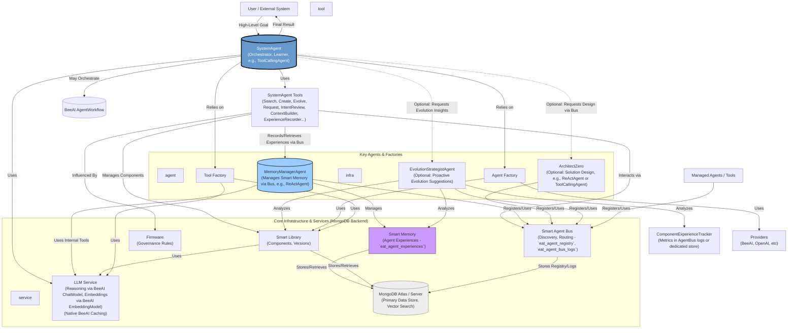
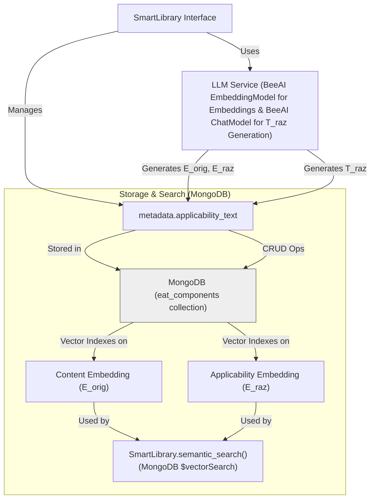
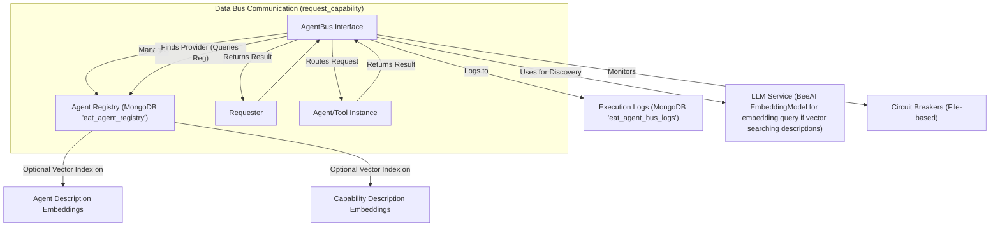
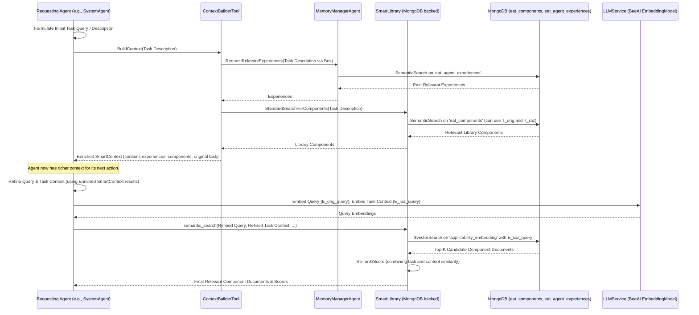
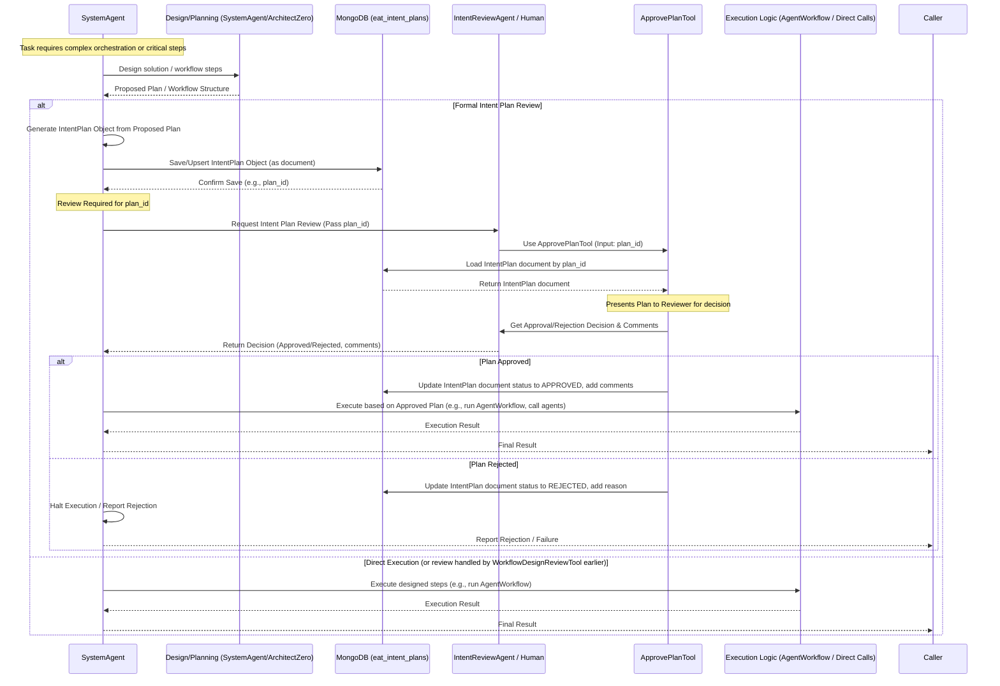

# Evolving Agents Toolkit - Architecture

This document details the architectural design of the Evolving Agents Toolkit (EAT), focusing on its core components, interactions, its unified **MongoDB backend**, and the role of the **Smart Memory ecosystem** in enabling advanced autonomous learning and evolution.

## 1. Introduction & Philosophy

The Evolving Agents Toolkit aims to provide a robust framework for building *ecosystems* of autonomous AI agents. The core philosophy is **agent-centric**: the system itself is managed and orchestrated by specialized agents (like the `SystemAgent`), which leverage tools to interact with underlying services and manage other components. All primary data, including component metadata, embeddings, agent registrations, operational logs, intent plans, and **detailed agent experiences (Smart Memory)**, is persisted in **MongoDB**. LLM and embedding call caching is handled by the underlying `beeai-framework`'s native caching system.

Key goals of the architecture include:

*   **Autonomy & Evolution:** Enable agents, components, and even system strategies to be created, evaluated, and improved over time, significantly informed by past experiences.
*   **Modularity & Reusability:** Promote component reuse through discovery and adaptation via the `SmartLibrary`.
*   **Interoperability:** Support agents and tools built with different underlying frameworks.
*   **Decoupled Communication:** Facilitate capability-based communication via the `SmartAgentBus`.
*   **Governance & Safety:** Embed safety through `Firmware` and an optional human-in-the-loop review process.
*   **Deep Contextual Understanding:** Provide agents with rich, task-relevant context dynamically constructed from `SmartLibrary`, current task data, and **historical experiences from Smart Memory**.
*   **Orchestration:** Enable complex goal achievement through `SystemAgent`-driven strategies, potentially leveraging `beeai-framework`'s `AgentWorkflow`.
*   **Cumulative Learning & Self-Improvement:** The **Smart Memory ecosystem** is central to enabling agents, particularly `SystemAgent`, to learn from past workflows, decisions, and outcomes. This learning directly informs better problem-solving, more effective component evolution, and potentially the evolution of the system's own operational strategies.
*   **Unified & Scalable Backend:** Utilize MongoDB for all persistent data.

---

*Diagram Key: `agent` = Core EAT Agent, `service` = Core EAT Service, `tool` = SystemAgent's Internal Tools, `infra` = Supporting Infrastructure. Smart Memory is highlighted as a key service.*

---

## 2. Core Components

The toolkit is composed of several key interacting components, all leveraging MongoDB for persistence where applicable.

### 2.1. SystemAgent

The central orchestrator, typically a `beeai_framework.agents.tool_calling.ToolCallingAgent` (or a similar advanced BeeAI agent type).
*   **Role:**
    *   Manages the lifecycle of components (agents, tools) by searching the `SmartLibrary`, creating new ones (using `CreateComponentTool`), or evolving existing ones (using `EvolveComponentTool`).
    *   Facilitates communication and task delegation via the `SmartAgentBus` (using `RequestAgentTool`, `DiscoverAgentTool`).
    *   Handles complex, multi-step task execution, potentially by designing and executing sequences of operations or by leveraging `beeai_framework.workflows.agent.AgentWorkflow` for more structured orchestration.
    *   **Crucially, actively utilizes the Smart Memory ecosystem for enhanced decision-making:**
        *   Uses `ContextBuilderTool` before significant planning or component selection to gather relevant past experiences and message summaries from the `MemoryManagerAgent`. This provides deep, historical context.
        *   Uses `ExperienceRecorderTool` after completing tasks or workflows to record significant outcomes, decisions, and learnings into Smart Memory, fostering continuous improvement for itself and the system.
    *   Manages optional human-in-the-loop review processes via intent review tools.
*   **Key Tools (Expanded):**
    *   **SmartLibrary Tools:** `SearchComponentTool`, `CreateComponentTool`, `EvolveComponentTool`.
    *   **SmartContext & Memory Tools:** `TaskContextTool` (for T_raz generation for search queries), `ContextBuilderTool` (constructs rich context using Smart Memory and SmartLibrary), `ExperienceRecorderTool` (records outcomes to Smart Memory).
    *   **AgentBus Tools:** `RegisterAgentTool`, `RequestAgentTool`, `DiscoverAgentTool`.
    *   **Intent Review Tools (Optional):** `WorkflowDesignReviewTool`, `ComponentSelectionReviewTool`, `ApprovePlanTool`.
    *   *(Note: Previous EAT-specific workflow tools like `GenerateWorkflowTool` and `ProcessWorkflowTool` are superseded by BeeAI's native `AgentWorkflow` capabilities or direct orchestration by `SystemAgent`.)*

### 2.2. ArchitectZero Agent

A specialized agent (e.g., `ReActAgent` or `ToolCallingAgent`) for designing solutions, typically invoked by `SystemAgent` via the `SmartAgentBus`.
*   **Role:** Analyzes complex requirements, queries `SmartLibrary` and potentially `SmartMemory` (if equipped with tools or via SystemAgent proxy) for existing patterns or components, and designs multi-component solutions. This design might take the form of a plan for `SystemAgent` or a structure for a `beeai_framework.workflows.agent.AgentWorkflow`.
*   **Output:** A structured solution design (e.g., JSON, or a sequence of steps for an `AgentWorkflow`) that `SystemAgent` can use as a blueprint.

### 2.3 Smart Memory Ecosystem

This is a critical addition for enabling advanced learning and autonomous evolution.
*   **`MemoryManagerAgent`**:
    *   **Role**: A `ReActAgent` (or potentially another BeeAI agent type) acting as the central orchestrator for the storage and retrieval of long-term memories (experiences). Registered on the `SmartAgentBus` (e.g., `memory_manager_agent_default_id`). It exposes a general `process_task` capability, allowing other agents (primarily `SystemAgent` via its tools) to send natural language requests for memory operations (e.g., "store this experience: {...}", "find experiences related to: 'invoice processing errors'").
    *   **Internal Tools**:
        *   `MongoExperienceStoreTool`: Handles CRUD operations for experiences in the `eat_agent_experiences` MongoDB collection, including generating embeddings for searchable text fields within an experience (using `LLMService`'s `EmbeddingModel`).
        *   `SemanticExperienceSearchTool`: Performs semantic (vector) searches over stored experiences in `eat_agent_experiences` based on natural language queries.
        *   `MessageSummarizationTool`: Uses an LLM (via `LLMService`'s `ChatModel`) to summarize message histories relevant to a specific goal, often requested by `ContextBuilderTool`.
*   **`ContextBuilderTool` (Tool for `SystemAgent`)**:
    *   **Purpose**: Dynamically constructs an optimized `SmartContext` instance for `SystemAgent` to use for a specific sub-task.
    *   **Functionality**: Invoked by `SystemAgent`. It uses `RequestAgentTool` to query the `MemoryManagerAgent` (to retrieve relevant past experiences and message summaries) and also directly queries `SmartLibrary` for relevant components. It assembles this information into a focused `SmartContext`.
*   **`ExperienceRecorderTool` (Tool for `SystemAgent`)**:
    *   **Purpose**: Facilitates the recording of completed tasks, sub-tasks, or entire workflows as structured experiences.
    *   **Functionality**: Invoked by `SystemAgent`. It structures task details (goal, components used, inputs, decisions, outputs, outcome, reasoning snippets) and uses `RequestAgentTool` to send this structured data to the `MemoryManagerAgent` for persistence in Smart Memory.
*   **MongoDB Collection: `eat_agent_experiences`**:
    *   **Purpose**: Stores structured records of agent experiences.
    *   **Key Fields**: Includes `experience_id`, `primary_goal_description` (embedded), `sub_task_description` (embedded), `input_context_summary` (embedded), `components_used`, `key_decisions_made`, `final_outcome`, `output_summary` (embedded), `feedback_signals`, `timestamp`, and generated `embeddings` for its searchable text fields. (A detailed schema is in `eat_agent_experiences_schema.md`).
    *   **Vector Search Index:** Requires an Atlas Vector Search index (e.g., `vector_index_experiences_default`) on its embedding fields.

### 2.4. Smart Library (MongoDB Backend)

Persistent storage and discovery for reusable components (agents, tools, firmware).
*   **MongoDB Collection:** `eat_components` (or configurable name).
*   **Stores:** Each component as a MongoDB document including its `id`, `name`, `record_type`, `domain`, `description`, `code_snippet`, `version`, `tags`, `metadata` (like `applicability_text`), and crucially, its `content_embedding` (E_orig) and `applicability_embedding` (E_raz) generated via `LLMService`'s `EmbeddingModel`.
*   **Discovery (Dual Embedding on MongoDB):**
    *   Uses **MongoDB Atlas Vector Search** (or equivalent) on the `content_embedding` and `applicability_embedding` fields within the `eat_components` collection.
    *   Supports **Task-Aware Semantic Search**: Primarily queries against `applicability_embedding` using task context, then refines using `content_embedding` similarity.
*   **Versioning & Evolution:** Tracks component versions and parentage within MongoDB documents.
*   **Interface:** Methods like `create_record`, `find_record_by_id`, `semantic_search`, `evolve_record` now perform CRUD and search operations against MongoDB.
*   **Indexing Pipeline:** When records are created/updated:
    *   `T_orig` (functional text from `_get_record_vector_text`) is embedded using `LLMService.embedding_model` to get `content_embedding`.
    *   `T_raz` (applicability text from `generate_applicability_text` via `LLMService.chat_model`) is generated and then embedded using `LLMService.embedding_model` to get `applicability_embedding`.
    *   Both embeddings and `T_raz` (in metadata) are stored directly in the component's MongoDB document.


*Diagram Note: `MongoDBLib` and `LLMSLib` are used to avoid name clashes with the main diagram's `MongoDB` and `LLMS` if rendered separately.*

### 2.5. Smart Agent Bus (MongoDB Backend)

Manages inter-agent communication and capability discovery.
*   **Agent Registry (MongoDB Collection):** `eat_agent_registry`. Stores agent registration documents (id, name, capabilities, status, etc.). Key infrastructure agents like `MemoryManagerAgent` are registered here.
    *   Optionally, capability descriptions can be embedded (`capability_description_embedding`) and stored here for semantic discovery of capabilities using MongoDB Vector Search.
*   **Execution Logs (MongoDB Collection):** `eat_agent_bus_logs`. Stores logs of System and Data Bus operations, providing valuable data for `ComponentExperienceTracker` and auditing.
*   **Role:** Central nervous system for capability-based requests (Data Bus) and agent/service registration/discovery (System Bus).
*   **Discovery:**
    *   Finds registered agents based on `capability_id` (metadata query on `eat_agent_registry`).
    *   For `task_description`-based discovery, it can query agent descriptions (potentially with vector search on `description_embedding` in `eat_agent_registry`) or leverage `SmartLibrary` to find agent *components* suitable for the task.
*   **Resilience:** Circuit breakers (currently file-based, future MongoDB) help manage agent availability.
*   **Interface:** Methods like `register_agent`, `discover_agents`, `request_capability`, etc., now interact with MongoDB.


*Diagram Note: `LLMSBus` used for clarity. Discovery uses MongoDB queries (metadata or vector).*

### 2.6. Smart Context

Data structure for passing task-relevant information between components, especially to agents.
*   **Role:** Carries current task data, user input, intermediate results from previous steps, and a description of the current task (`current_task`).
*   **Enhancement via `ContextBuilderTool`**: It is **dynamically enriched** by the `ContextBuilderTool`. This tool populates the `SmartContext` with:
    *   Summaries of relevant past experiences and message histories (retrieved via the `MemoryManagerAgent` from `SmartMemory`).
    *   Information about relevant existing components (retrieved from `SmartLibrary`).
    This provides agents like `SystemAgent` with deeper, historically-informed context for their current tasks.
*   **Interaction with `SmartLibrary`:** The `current_task` description it holds (often enhanced) is used by `SmartLibrary.semantic_search` to leverage the dual embeddings (E_raz) for more accurate, task-aware component retrieval.

### 2.7. EvolutionStrategistAgent (Optional)

*   **Role:** A specialized agent (potentially a `ReActAgent` or `ToolCallingAgent`) designed to proactively analyze system performance, component experiences, and library structure to identify and suggest opportunities for evolution. It acts as a higher-level "improvement engine."
*   **Data Sources for Analysis:**
    *   `ComponentExperienceTracker`: For quantitative performance metrics (success/failure rates, execution times, error frequencies) derived from `SmartAgentBus` logs or a dedicated metrics store.
    *   `SmartMemory` (via `MemoryManagerAgent`): To analyze patterns in successful/failed experiences, understanding *why* components perform as they do in specific contexts. This provides qualitative insights.
    *   `SmartLibrary`: To understand the current inventory of components, their versions, and identify gaps or redundancies.
    *   A/B Test Results (if applicable, from `eat_ab_test_results` collection): To compare versions of components.
    *   `LibraryAuditorAgent` outputs: Can consume reports about unused, orphaned, or low-performing components.
*   **Output:** Evolution proposals or directives. These could be:
    *   Suggestions to `SystemAgent` (e.g., "Evolve component X to better handle task Y, as it has failed N times. Consider incorporating logic from component Z which succeeded on similar tasks.").
    *   Direct initiation of evolution tasks via `EvolveComponentTool` if granted sufficient autonomy.
    *   Proposals for creating entirely new components to fill identified capability gaps.

### 2.8. Providers & Agent Factory

*   **`Providers` (e.g., `BeeAIProvider`, `OpenAIAgentsProvider`):** Abstract the specifics of interacting with different underlying AI agent frameworks. They handle the creation and execution of agents built with those frameworks, using BeeAI's `ChatModel`, `EmbeddingModel`, tools, and agent types (like `ToolCallingAgent`) where appropriate.
*   **`AgentFactory`:** Uses the `ProviderRegistry` to select the appropriate `FrameworkProvider` based on a component's specified framework (e.g., "beeai", "openai-agents"). It then delegates agent creation to that provider. It can also instantiate tools directly if they are simple Python classes.

### 2.9. Dependency Container

*   **Role:** A simple Inversion of Control (IoC) container (`DependencyContainer`) manages the instantiation and sharing of core singleton services like `MongoDBClient`, `LLMService`, `SmartLibrary`, `SmartAgentBus`, and key agents like `SystemAgent`, `MemoryManagerAgent`.
*   **Benefits:** Decouples components, simplifies initialization, and makes dependencies explicit. Components can request their dependencies from the container rather than instantiating them directly.

### 2.10. LLM Service (Leveraging BeeAI Native Capabilities)

*   **Role:** Provides a unified interface for EAT components to access Large Language Models (LLMs) and embedding functionalities. It now primarily acts as a wrapper or direct user of `beeai-framework`'s native model and caching capabilities.
*   **Models:**
    *   **Chat Models:** Instantiated via `beeai_framework.backend.ChatModel.from_name("provider:model_name", cache=...)`. EAT's `LLMService.generate()` method calls `self.chat_model.create()`.
    *   **Embedding Models:** Instantiated via `beeai_framework.backend.EmbeddingModel.from_name("provider:model_name", cache=...)`. EAT's `LLMService.embed()` and `embed_batch()` methods call `self.embedding_model.create()`.
*   **Frameworks:** Leverages `LiteLLM` through `beeai-framework` for broad compatibility with various LLM providers (OpenAI, Anthropic, Ollama, etc.).
*   **Caching (Native BeeAI Caching):**
    *   EAT's custom `LLMCache` (and the `eat_llm_cache` MongoDB collection) is **deprecated and removed**.
    *   Caching for LLM completions and embedding results is handled by `beeai-framework`'s native, pluggable caching system (e.g., `UnconstrainedCache`, `SlidingCache`).
    *   The chosen cache instance is passed to `ChatModel.from_name()` and `EmbeddingModel.from_name()` during their instantiation in `LLMService`. This automatically enables caching for all subsequent `create()` calls on these model instances.
    *   This approach simplifies EAT's codebase and leverages the more robust and flexible caching provided by the BeeAI framework.

### 2.11. Firmware

*   **Role:** The `Firmware` class provides a mechanism to inject standardized governance rules, ethical guidelines, and operational constraints into agents and tools, particularly during their creation or evolution.
*   **Functionality:** It generates a base prompt incorporating general rules and can include domain-specific rules (e.g., for "medical" or "finance"). This prompt is typically prepended to the main instruction set given to LLMs when generating or modifying component code or behavior.
*   **Persistence:** Firmware rules themselves are typically code-defined within the `Firmware` class, not dynamically stored as individual `SmartLibrary` components, though specific firmware *configurations* or *overrides* could potentially be.

### 2.12. Adapters

*   **Role:** `Adapters` (e.g., `OpenAIToolAdapter`, `OpenAIGuardrailsAdapter`) serve as bridges between EAT's internal component structures/interfaces and the specific requirements of external AI agent SDKs or frameworks (like OpenAI Agents SDK).
*   **Functionality:**
    *   `OpenAIToolAdapter`: Converts EAT-compatible tools (e.g., BeeAI tools, dynamic tools) into a format usable by OpenAI Agents.
    *   `OpenAIGuardrailsAdapter`: Converts EAT's `Firmware` concepts into input/output guardrails compatible with the OpenAI Agents SDK.
*   **Importance:** They enable interoperability and allow EAT to leverage components and functionalities from various ecosystems. The migration to newer BeeAI versions might reduce the need for some adapters if BeeAI offers more direct integrations (e.g., improved OpenAI SDK support).

### 2.13. Intent Review System (MongoDB Backend)

*   **Role:** Provides an optional human-in-the-loop (HITL) mechanism for reviewing and approving actions before execution, enhancing safety and control.
*   **`IntentPlan` Storage (MongoDB Collection):** `eat_intent_plans`.
    *   When intent review is enabled for the "intents" level, and if a structured plan is generated (e.g., by `SystemAgent` or `ArchitectZero`, potentially before constructing an `AgentWorkflow`), this plan can be stored as an `IntentPlan` object.
    *   These `IntentPlan` objects are serialized and stored as documents in this MongoDB collection.
*   **Review Process:**
    *   The `IntentReviewAgent` (or a human user directly) uses tools like `ApprovePlanTool`.
    *   `ApprovePlanTool` loads the `IntentPlan` from MongoDB by its `plan_id`, facilitates the review, and then updates the plan's status (e.g., "APPROVED", "REJECTED") and any reviewer comments directly in its MongoDB document.
*   **Other Review Tools:** `WorkflowDesignReviewTool` and `ComponentSelectionReviewTool` allow for earlier-stage reviews of proposed agent/tool selections or workflow structures (including `AgentWorkflow` designs). Their outputs might not always be persisted as formal `IntentPlan` objects unless they feed into one.

## 3. Key Architectural Patterns & Flows

### 3.1. Agent Communication (via Agent Bus)

The `SmartAgentBus` is the central nervous system for the EAT ecosystem, facilitating both system-level management and data-level interactions between components. It operates as a dual-bus system, with distinct functionalities for managing the agent/tool registry and for routing capability requests. Both aspects now leverage MongoDB for persistence.

**A. System Bus Functionality (Management & Discovery):**

*   **Registration:**
    *   Agents and tools (components) are registered with the `SmartAgentBus` using tools like `RegisterAgentTool` (typically invoked by `SystemAgent` or during system initialization from `SmartLibrary`).
    *   Registration involves providing metadata about the component, including its ID, name, type (AGENT/TOOL), description, and a list of capabilities it offers.
    *   This registration data is stored in the `eat_agent_registry` MongoDB collection. Each entry includes the component's metadata and, importantly, an embedding of its description (`description_embedding`) if semantic discovery is enabled.
*   **Discovery:**
    *   Agents (like `SystemAgent`) can discover other components based on various criteria:
        *   **By Capability ID:** Requesting all agents that offer a specific `capability_id`. The bus queries the `eat_agent_registry` for matching capability entries.
        *   **By Task Description (Semantic Discovery):** An agent can provide a natural language `task_description`. The `SmartAgentBus` (or a tool like `DiscoverAgentTool`) can:
            1.  Embed this `task_description`.
            2.  Perform a vector search against the `description_embedding` field in the `eat_agent_registry` collection to find agents whose overall purpose matches the task.
            3.  Alternatively, it can leverage `SmartLibrary.semantic_search` to find *component definitions* (which might be more fine-grained) suitable for the task, and then check if those components are registered and active on the bus.
    *   Discovery results include information about the found agents, their status (e.g., active, circuit-broken), and potentially relevance scores.
*   **Status Management:** The bus can track the health and status of registered agents (e.g., using circuit breakers, though the state for these is currently file-based with plans to move to MongoDB).

**B. Data Bus Functionality (Capability Request & Execution):**

*   **Request Routing:**
    *   When an agent (Requester) needs a specific capability performed (e.g., `SystemAgent` using `RequestAgentTool`), it sends a request to the `SmartAgentBus`.
    *   The request typically includes the `capability_id` and the `content` (input data/parameters) for that capability.
    *   The `SmartAgentBus` uses its registry (`eat_agent_registry`) to find one or more active and healthy agents (Providers) that offer the requested `capability_id` and meet any other criteria (like minimum confidence).
    *   If multiple providers are found, the bus might employ a selection strategy (e.g., round-robin, load-based, highest confidence – currently simpler, often takes the first suitable).
*   **Execution:**
    *   The bus routes the request `content` to the selected Provider agent/tool instance.
    *   The Provider executes the capability using the provided `content`. This now involves the BeeAI framework's standard agent execution (e.g., `agent.run(prompt, context)` which returns a `Run` object).
    *   The result of the execution (extracted from the `Run` object) is returned to the `SmartAgentBus`.
*   **Response Delivery:** The `SmartAgentBus` relays the result back to the original Requester.
*   **Logging:** All significant Data Bus operations (requests, which agent handled it, success/failure, duration) are logged to the `eat_agent_bus_logs` MongoDB collection. This provides an audit trail and data for `ComponentExperienceTracker`. Observability can be further enhanced by subscribing to BeeAI's native event stream (`Run.on()`).

**C. Key Characteristics:**

*   **Decoupling:** Agents do not need direct references to each other. They request capabilities, and the bus handles routing. This promotes modularity and makes it easier to add, remove, or update components.
*   **Dynamic Discovery:** The system can adapt to new agents becoming available or existing ones changing their capabilities.
*   **Centralized Management:** The bus provides a central point for monitoring agent interactions and managing the ecosystem.
*   **Resilience (via Circuit Breakers):** The bus can temporarily prevent requests to agents that are consistently failing, improving overall system stability.
*   **MongoDB Backend:** Storing the registry and logs in MongoDB enhances scalability, persistence, and the ability to perform complex queries over historical interactions.

This dual-bus architecture, backed by MongoDB, is fundamental to EAT's ability to orchestrate a dynamic and evolving ecosystem of agents and tools.

### 3.2. Task-Aware Context Retrieval (Dual Embedding on MongoDB)

The core logic for how `SmartLibrary` uses dual embeddings remains, but the `task_context` itself is now often significantly richer due to pre-processing by `ContextBuilderTool` which queries `SmartMemory`.

1.  **Query Formulation:** `SystemAgent` (or another agent) has a `query` (what it's looking for) and a `task_description` (the current task it's trying to solve).
2.  **Context Enrichment (via `ContextBuilderTool`):** Often, before searching the library, `SystemAgent` will use `ContextBuilderTool`. This tool queries `SmartMemory` (via `MemoryManagerAgent`) for relevant past experiences and message summaries related to the `task_description`. It also queries `SmartLibrary` for an initial set of relevant components. The output of `ContextBuilderTool` provides an *enriched task context*.
3.  **Embedding for Search:** `LLMService` (using BeeAI's `EmbeddingModel`) embeds the original `query` (for E_orig) and the (potentially enriched) `task_description` (for E_raz).
4.  **Applicability Search (MongoDB `$vectorSearch`):** `SmartLibrary.semantic_search` uses the `task_description` embedding (E_raz_query) to query the `applicability_embedding` field in the `eat_components` MongoDB collection. This prioritizes components whose purpose aligns with the current task.
5.  **Refinement & Scoring:**
    *   `SmartLibrary` retrieves candidate component documents from MongoDB, which include their `content_embedding` (E_orig).
    *   It calculates the similarity between the `query` embedding (E_orig_query) and each candidate's `content_embedding`.
    *   A `final_score` is computed by combining the task relevance score (from applicability search) and the content similarity score, often weighted (e.g., `task_weight`). Usage history can also provide a small boost.
6.  **Result:** `SmartLibrary` returns a list of the most relevant component documents, ranked by their `final_score`.



### 3.3. Agent Learning and Context Enrichment Flow (with Smart Memory)

This is a **central flow** enabled by the Smart Memory ecosystem:

1.  **Task Initiation:** `SystemAgent` receives a high-level goal.
2.  **Context Building (Proactive):** `SystemAgent` uses `ContextBuilderTool`.
    *   `ContextBuilderTool` sends a request to `MemoryManagerAgent` (via `SmartAgentBus`) with the current sub-task description.
    *   `MemoryManagerAgent` uses `SemanticExperienceSearchTool` to find relevant past experiences from `eat_agent_experiences`.
    *   `MemoryManagerAgent` uses `MessageSummarizationTool` to summarize relevant recent message history (if provided to `ContextBuilderTool`).
    *   `ContextBuilderTool` also queries `SmartLibrary` (MongoDB `eat_components`) for potentially relevant existing components.
    *   `ContextBuilderTool` returns a structured dataset containing these findings to `SystemAgent`.
3.  **Informed Planning & Action:** `SystemAgent` (e.g., a `ToolCallingAgent`) incorporates this rich context into its planning and execution:
    *   More accurate component selection (via `SearchComponentTool` now using better task context, or by directly choosing from `ContextBuilderTool`'s suggestions).
    *   Better design of multi-step processes or `AgentWorkflow` configurations.
    *   More targeted parameters for tool/agent execution.
4.  **Task Execution:** `SystemAgent` orchestrates the execution of the planned steps, potentially by invoking other agents via the `SmartAgentBus` or executing an `AgentWorkflow`.
5.  **Experience Recording:** After a significant sub-task or the overall task is completed (or fails), `SystemAgent` uses `ExperienceRecorderTool`.
    *   `ExperienceRecorderTool` structures the key details of the just-completed experience (goal, input summary, components used, decisions, output summary, outcome, reasoning snippets).
    *   It sends this structured experience to `MemoryManagerAgent` (via `SmartAgentBus`).
    *   `MemoryManagerAgent` uses `MongoExperienceStoreTool` to save the experience (including generating its embeddings via `LLMService`) into the `eat_agent_experiences` collection in MongoDB.
6.  **Learning Loop Closure:** The newly recorded experience is now available for future `ContextBuilderTool` queries, allowing the system to learn and improve over time. Observability can be enhanced by subscribing to BeeAI's native event stream (`Run.on()`) using `ComponentExperienceTracker`.

### 3.4. Informed Component Evolution

Smart Memory plays a vital role in making component evolution more targeted and effective:

1.  **Identification of Need:**
    *   `SystemAgent` might identify a need for evolution based on repeated failures for a specific task type (retrieved from Smart Memory).
    *   Or, `EvolutionStrategistAgent` might analyze `eat_agent_experiences` and `ComponentExperienceTracker` data to proactively suggest evolutions.
2.  **Contextual Evolution Prompting:** When `SystemAgent` decides to evolve a component using `EvolveComponentTool`:
    *   It first uses `ContextBuilderTool` to gather context related to the component-to-be-evolved and the problem it's failing to solve (or the new capability needed).
    *   This context (e.g., "Component X failed 3 times on task Y when input was Z, resulting in error W. Component A handles similar inputs P successfully.") is used to formulate a much more specific and informed "changes" description for `EvolveComponentTool`.
3.  **LLM-Driven Evolution:** `EvolveComponentTool` uses the LLM (via `LLMService`) to generate new code based on the parent component's code and this rich, contextual "changes" description.
4.  **New Version in Library:** The evolved component is saved as a new version in `SmartLibrary`.
5.  **Future Use:** This new, contextually-evolved component is now available for future tasks and will be discoverable via `SmartLibrary` searches, further improving system performance.

### 3.5. Workflow Orchestration with BeeAI `AgentWorkflow`

With the migration to a newer `beeai-framework`, EAT's custom YAML-based workflow engine (`GenerateWorkflowTool`, `ProcessWorkflowTool`) is **deprecated and replaced** by leveraging BeeAI's native `AgentWorkflow` or direct orchestration by `SystemAgent` (which is often a `ToolCallingAgent` capable of multi-step reasoning).

*   **Design Phase:**
    *   `ArchitectZero` or `SystemAgent` can design a sequence of tasks or steps required to achieve a complex goal. This design can be informed by `SmartLibrary` searches and `SmartMemory` context.
    *   The output of this design phase is a structured plan outlining the agents/tools to be used and their roles or specific prompts.
*   **Execution with `AgentWorkflow`:**
    *   The orchestrating script (e.g., an example script, or `SystemAgent` itself if it's managing the workflow) can dynamically construct a `beeai_framework.workflows.agent.AgentWorkflow` instance.
    *   Specialized agents (which could be instances of `ToolCallingAgent`, `ReActAgent`, or custom BeeAI agents) are added to this workflow, each configured for a specific step in the designed plan.
        ```python
        # Example:
        # from beeai_framework.workflows.agent import AgentWorkflow, AgentWorkflowInput
        # from evolving_agents.agents.agent_factory import AgentFactory # To get agent instances
        #
        # workflow = AgentWorkflow(name="InvoiceProcessing")
        #
        # ocr_agent = AgentFactory.create_agent("OCRSpecialistAgentComponentID")
        # extractor_agent = AgentFactory.create_agent("InvoiceDataExtractorComponentID")
        #
        # workflow.add_agent(agent=ocr_agent, name="InvoiceReader", role="Extracts text from invoice images.")
        # workflow.add_agent(agent=extractor_agent, name="DataExtractor", role="Extracts structured data from text.")
        # # ... add more agents/steps
        #
        # result = await workflow.run(inputs=[
        #     AgentWorkflowInput(prompt="Process attached invoice image.", agent="InvoiceReader"),
        #     AgentWorkflowInput(prompt="Extract key details from the OCR text.", agent="DataExtractor"),
        #     # ... other inputs mapping to workflow steps
        # ])
        ```
*   **Direct Orchestration by `SystemAgent`:**
    *   If `SystemAgent` is a `ToolCallingAgent`, it can manage multi-step processes by reasoning about the sequence of tools to call or sub-prompts to issue to itself or other agents via the `SmartAgentBus`. This provides flexibility for less rigidly structured workflows.
*   **Benefits:**
    *   Leverages a robust, maintained workflow engine from the core framework.
    *   Simplifies EAT's codebase by removing custom workflow logic.
    *   Potentially benefits from `AgentWorkflow`'s built-in error handling, state management, and observability features.
*   **Intent Review:** If intent review is needed for a workflow designed to use `AgentWorkflow`, the review would focus on the proposed sequence of agents, their configurations, and roles within the workflow *before* the `AgentWorkflow` is constructed and run. The `WorkflowDesignReviewTool` can be adapted for this.

### 3.6. Dependency Injection & Initialization
The `DependencyContainer` is used at application startup to instantiate and wire together core services (`MongoDBClient`, `LLMService`, `SmartLibrary`, `SmartAgentBus`, `Firmware`) and key agents (`SystemAgent`, `ArchitectZero`, `MemoryManagerAgent`, `IntentReviewAgent`). This promotes loose coupling and centralized management of shared resources. Core components like `SmartLibrary` and `SmartAgentBus` have `initialize()` methods that might perform further setup, like loading data from MongoDB or syncing registries, once all their dependencies are available.

### 3.7. Intent Review / Human-in-the-Loop Flow (MongoDB Backend)

1.  **Design Review (Optional):** `SystemAgent` can use `WorkflowDesignReviewTool` to get human/AI feedback on a high-level solution design (e.g., from `ArchitectZero`, or a proposed `AgentWorkflow` structure) before detailed planning or execution.
2.  **Component Selection Review (Optional):** `SystemAgent` can use `ComponentSelectionReviewTool` after a `SearchComponentTool` run to get human/AI validation of the chosen components for a task or workflow step.
3.  **Intent Plan Generation & Persistence:** If a formal plan needs review before execution (especially for complex orchestrations not fully managed by a single `AgentWorkflow` run, or for specific critical steps), `SystemAgent` can still generate a detailed `IntentPlan` object. This object, containing each step, its parameters, and justification, is serialized and saved as a document in the `eat_intent_plans` MongoDB collection. The `plan_id` is returned.
4.  **Intent Plan Review (Core):** `SystemAgent` (or a human operator) then uses `ApprovePlanTool`, providing the `plan_id`. `ApprovePlanTool` loads the `IntentPlan` from MongoDB, facilitates interactive or AI-assisted review, and updates the plan's status (e.g., to `APPROVED` or `REJECTED`) and reviewer comments directly in its MongoDB document.
5.  **Execution Post-Approval:** If the `IntentPlan` is `APPROVED`, `SystemAgent` would typically load this approved plan (or its constituent intents) from MongoDB to guide the safe execution of the task, which might involve running one or more `AgentWorkflow` instances or directly invoking agents/tools.



## 4. Multi-Framework Integration
EAT is designed for interoperability. The `ProviderRegistry` and `FrameworkProvider` abstract base class allow integration with various agent frameworks (e.g., BeeAI, OpenAI Agents SDK). `AgentFactory` uses this registry to instantiate agents based on the framework specified in their `SmartLibrary` record. Adapters (like `OpenAIToolAdapter`) help bridge EAT's internal tool formats with those expected by specific SDKs. The migration to the latest BeeAI framework strengthens this by ensuring EAT's core BeeAI-based components use up-to-date BeeAI patterns (e.g., `ChatModel`, `EmbeddingModel`, `ToolCallingAgent`, `AgentWorkflow`).

## 5. Governance and Safety
Safety and governance are integrated through:
*   **`Firmware`:** Injects common ethical and operational rules into components during their creation or evolution, guiding LLM behavior.
*   **Intent Review System:** Provides optional human-in-the-loop checkpoints at various stages (design, component selection, intent execution) to validate system plans and actions before they proceed. The persistence of `IntentPlan`s in MongoDB aids auditability.
*   **`SmartAgentBus` Circuit Breakers:** Help prevent cascading failures by temporarily disabling agents that repeatedly fail or timeout.
*   **Smart Memory:** While primarily for learning, recorded experiences (especially failures and their contexts) can be analyzed to identify systemic risks or unsafe component behaviors, contributing to long-term safety improvements.
*   **BeeAI Native Features:** Newer versions of `beeai-framework` may include enhanced safety features, better tool execution control (e.g., `tool_choice` in `ToolCallingAgent`), and more robust error handling, which EAT will inherit.

This enhanced architecture, with Smart Memory at its core and leveraging the latest `beeai-framework` capabilities, provides a more powerful foundation for EAT to achieve its goal of building adaptive, learning, and autonomously evolving AI agent systems. The ability to learn from rich, contextualized past experiences allows the system to make more intelligent decisions about current tasks and future evolutions.